# E-Commerce Backend API

A comprehensive Node.js and Express.js backend API for an e-commerce platform with user authentication, product management, cart functionality, order processing, and admin features.

## 🚀 Features

- **User Management**: Registration, login, email verification, password reset
- **Product Catalog**: Categories, subcategories, products with image uploads
- **Shopping Cart**: Add, update, remove items with stock validation
- **Order Management**: Order creation, status tracking, admin order management
- **Admin Panel**: Staff management, user management, product/category management
- **Coupon System**: Discount coupons for users
- **Authentication & Authorization**: JWT-based auth with role-based access control
- **Email Services**: Verification emails, password reset, notifications

## 🛠️ Tech Stack

- **Runtime**: Node.js with ES6 Modules
- **Framework**: Express.js 5.2.1
- **Database**: MongoDB with Mongoose ODM
- **Authentication**: JWT (JSON Web Tokens)
- **Validation**: Joi for input validation
- **File Upload**: Multer for image handling
- **Email**: Nodemailer for email services
- **Password Hashing**: bcrypt
- **Testing**: Jest with Supertest
- **Documentation**: Mermaid flowcharts for API documentation

## 📋 Prerequisites

- Node.js (v16 or higher)
- MongoDB (local or cloud instance)
- npm or yarn package manager

## 🚀 Quick Start

1. **Clone the repository**

   ```bash
   git clone <repository-url>
   cd e-commerce-backend
   ```

2. **Install dependencies**

   ```bash
   npm install
   ```

3. **Environment Setup**

   Copy the environment configuration and update as needed:

   ```bash
   cp config/.env.example config/.env
   ```

   Update the following variables in `config/.env`:

   ```env
   PORT = 3000
   EMAIL = your-email@gmail.com
   PASSWORD = your-app-password
   HASH = 12
   BASE_URL = http://localhost:3000
   SIGNATURE_ADMIN = signatureAdmin
   SIGNATURE_USER = signatureUser
   SIGNATURE_STAFF = signatureStaff
   ACCESS_TOKEN = 1d
   REFRESH_TOKEN = 1y
   DATA_BASE_URL_MY = mongodb://localhost:27017/e-commerce-nti
   VERIFY_SIGNATURE_MY = my
   ```

4. **Start MongoDB**

   ```bash
   # For local MongoDB
   mongod
   ```

5. **Run the application**

   ```bash
   # Development mode with auto-restart
   npm start

   # Or run directly
   node src/main.js
   ```

6. **Access the API**
   The server will start on `http://localhost:3000`

## 📁 Project Structure

```
├── src/
│   ├── app.controller.js          # Main Express app setup
│   ├── main.js                    # Application entry point
│   ├── common/                    # Shared utilities and middleware
│   │   ├── middleware/            # Express middleware
│   │   └── utils/                 # Utility functions
│   ├── database/                  # Database configuration
│   │   ├── connection.js          # MongoDB connection
│   │   └── model/                 # Mongoose models
│   └── module/                    # Feature modules
│       ├── auth/                  # Authentication
│       ├── users/                 # User management
│       ├── categories/            # Product categories
│       ├── subCategories/         # Subcategories
│       ├── products/              # Product management
│       ├── carts/                 # Shopping cart
│       ├── orders/                # Order processing
│       ├── staffs/                # Staff management
│       └── coupons/               # Coupon system
├── config/                        # Configuration files
├── flowcharts/                    # API documentation with flowcharts
├── uploads/                       # File upload directory
└── tests/                         # Test files
```

## 🔐 Authentication & Authorization

The API uses JWT-based authentication with three user roles:

- **User**: Regular customers with shopping and order capabilities
- **Admin**: Full system access including user and product management
- **Staff**: Limited access for order processing and customer service

### Authentication Flow

1. **Login**: User provides credentials → JWT tokens generated
2. **Access Token**: Short-lived token for API requests (1 day)
3. **Refresh Token**: Long-lived token for token renewal (1 year)
4. **Role-based Access**: Middleware checks user role for protected endpoints

## 📊 API Flowcharts

This project includes comprehensive API flowcharts in the `flowcharts/` directory. Each flowchart visually represents the API logic, including validation, business rules, error handling, and success paths.

### 🔐 Authentication Flowcharts

#### User Registration Flow

```mermaid
flowchart TD
    A[Client Request] --> B{Validate Input}
    B -->|Invalid| C[Return 400 - Validation Error]
    B -->|Valid| D{Check Email Exists}
    D -->|Exists & Active| E[Return 400 - Email Already Exists]
    D -->|Password Mismatch| F[Return 400 - Password Not Matched]
    D -->|Valid| G[Hash Password]
    G --> H{Avatar Uploaded?}
    H -->|Yes| I[Save Avatar URL]|
    H -->|No| J[Continue Without Avatar]|
    I --> K{User Exists Inactive?}||
    J --> K
    K -->|Yes| L[Update Existing User]||
    K -->|No| M[Create New User]||
    L --> N[Generate Verification Token]
    M --> N
    N --> O[Send Verification Email]
    O --> P[Return 200 - Success]
```

#### User Login Flow

```mermaid
flowchart TD
    A[Client Request] --> B{Validate Input}
    B -->|Invalid| C[Return 400 - Validation Error]
    B -->|Valid| D[Find User by Email]
    D -->|Not Found/Inactive| E[Return 400 - Invalid Credentials]
    D -->|Found| F{Compare Password}
    F -->|Mismatch| E||
    F -->|Match| G{Email Verified?}
    G -->|No| H[Return 400 - Email Not Verified]||
    G -->|Yes| I[Generate Access Token]
    I --> J[Generate Refresh Token]||
    J --> K[Return 200 - Login Success]
```

### Shopping Cart Flowcharts

#### Add Item to Cart Flow

```mermaid
flowchart TD
    A[Client Request] --> B[Auth Middleware]
    B -->|No Auth| C[Return 401 - Login First]
    B -->|Auth Valid| D[Find User by ID]
    D -->|Not Found/Inactive| E[Return 404 - User Not Found]
    D -->|Found| F[Find Product by ID]
    F -->|Not Found/Inactive| G[Return 404 - Product Not Found]
    F -->|Found| H{Quantity Provided?}
    H -->|No| I[Set Quantity = 1]
    H -->|Yes| J[Use Provided Quantity]
    I --> K{Stock Available?}
    J --> K
    K -->|Insufficient| L[Return 404 - Insufficient Stock]
    K -->|Available| M[Check if Item Already in Cart]|
    M -->|Exists| N[Update Quantity]
    M -->|Not Exists| O[Add New Cart Item]
    N --> P{New Total Stock OK?}|
    P -->|Insufficient| Q[Return 404 - Insufficient Stock]|
    P -->|Available| R[Update Cart Item]
    R --> S[Return 200 - Cart Updated]
    O --> T[Create Cart Item]
    T --> U[Return 200 - Item Added]
```

### Product Management Flowcharts

#### Create Product Flow (Admin Only)

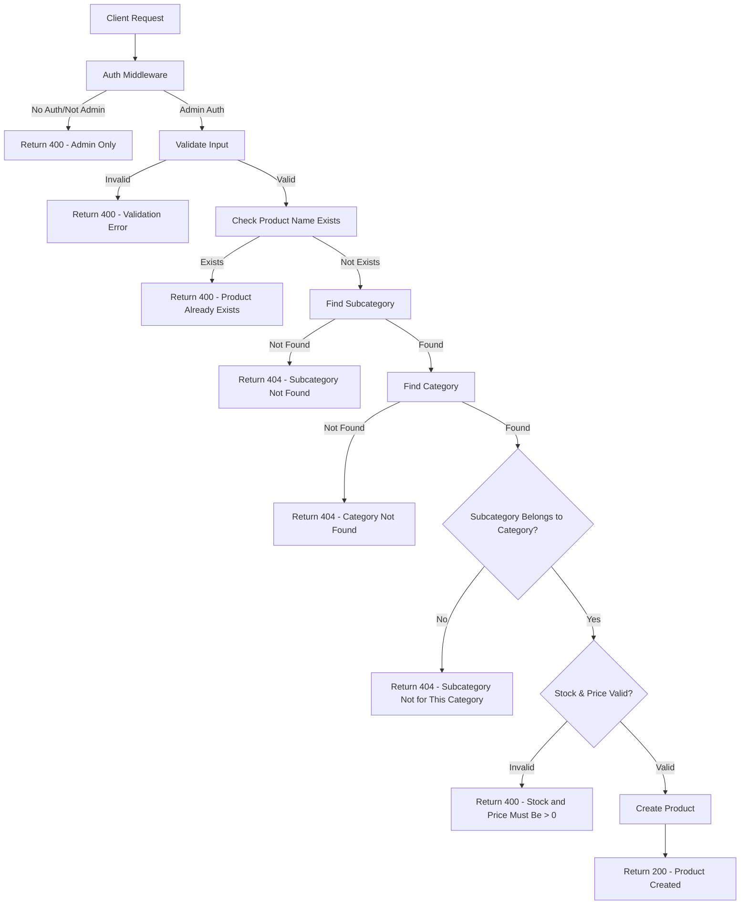

### Available Flowcharts

The complete flowcharts are available in the `flowcharts/` directory:

#### 1. Authentication APIs

- **User Registration**: Complete signup flow with email verification
- **User Login**: Authentication with token generation
- **Email Verification**: Token-based email verification
- **Password Reset**: OTP-based password recovery
- **Token Refresh**: Access token renewal

#### 2. User Management APIs

- **Profile Management**: View, update, and delete user profiles
- **Profile Image Upload**: Avatar management

#### 3. Product Management APIs

- **Product CRUD**: Create, read, update, delete products (admin only)
- **Category Management**: Category and subcategory operations
- **Product Search**: Filtered product browsing

#### 4. Shopping Cart APIs

- **Cart Operations**: Add, update, remove items
- **Stock Validation**: Real-time stock checking
- **Cart Management**: View and clear cart

#### 5. Order Management APIs

- **Order Creation**: Checkout process with cart items
- **Order Tracking**: Status updates and history
- **Admin Order Management**: Order processing and fulfillment

#### 6. Staff Management APIs

- **Staff CRUD**: Staff member management
- **Check-in/Check-out**: Attendance tracking
- **Deduction Management**: Salary deductions

#### 7. Coupon System APIs

- **Coupon Management**: Create and manage discount codes
- **Coupon Application**: Apply discounts to orders

### How to View Flowcharts

These flowcharts are written in Mermaid syntax and can be viewed using:

- **GitHub/GitLab**: Automatic Mermaid rendering
- **VS Code**: Install Mermaid Preview extension
- **Online**: Use [mermaid.live](https://mermaid.live) or [Mermaid.js](https://mermaid-js.github.io)
- **Markdown Editors**: Most modern editors support Mermaid

## 🖼️ Flowchart Images

In addition to the Mermaid diagrams above, the project includes visual flowchart images for each API endpoint. These images are located in the `flowcharts/images/` directory and provide a visual representation of each API flow.

### 🔐 Authentication API Images

| API Endpoint                                | Flowchart Image                                                                            |
| ------------------------------------------- | ------------------------------------------------------------------------------------------ |
| POST /api/v1/auth/signup                    |                                        |
| POST /api/v1/auth/login                     |                                          |
| GET /api/v1/auth/verify-email/:token        |                            |
| POST /api/v1/auth/resend-verification       |              |
| POST /api/v1/auth/forget-password           |                      |
| POST /api/v1/auth/reset-password            |                        |
| POST /api/v1/auth/generate-new-access-token |  |
| Refresh Token Flow                          |                          |

### 🛒 Shopping Cart API Images

| API Endpoint                   | Flowchart Image                                                                  |
| ------------------------------ | -------------------------------------------------------------------------------- |
| POST /api/v1/cart              |                    |
| POST /api/v1/cart (Add Item)   |          |
| PUT /api/v1/cart/:productId    |  |
| GET /api/v1/cart               |                        |
| DELETE /api/v1/cart/:productId |          |
| DELETE /api/v1/cart            |                      |

### 📂 Category API Images

| API Endpoint                     | Flowchart Image                                                                                |
| -------------------------------- | ---------------------------------------------------------------------------------------------- |
| POST /api/v1/categories          |                      |
| PUT /api/v1/categories/:id       |                      |
| DELETE /api/v1/categories/:id    |                      |
| GET /api/v1/categories/admin     |            |
| GET /api/v1/categories           |          |
| GET /api/v1/categories/:id/admin |  |

### 🎫 Coupon API Images

| API Endpoint                  | Flowchart Image                                                                      |
| ----------------------------- | ------------------------------------------------------------------------------------ |
| POST /api/v1/coupons/admin    |                        |
| GET /api/v1/coupons/admin     |  |
| GET /api/v1/coupons/admin/:id |    |
| PUT /api/v1/coupons/admin     |                  |
| DELETE /api/v1/coupons/admin  |                  |
| GET /api/v1/coupons           |    |
| GET /api/v1/coupons/:id       |      |

### 📋 Order API Images

| API Endpoint            | Flowchart Image                                                                              |
| ----------------------- | -------------------------------------------------------------------------------------------- |
| POST /checkout          |                            |
| GET /                   |                      |
| GET /:id                |                    |
| GET /admin              |            |
| PATCH /admin/:id/status |  |
| Order Security Checks   |                  |
| Order Status Flow       |                          |
| Payment Methods Flow    |                    |

### 📦 Product API Images

| API Endpoint                  | Flowchart Image                                                                   |
| ----------------------------- | --------------------------------------------------------------------------------- |
| POST /api/v1/products         |            |
| PUT /api/v1/products/:id      |            |
| DELETE /api/v1/products/:id   |            |
| GET /api/v1/products/admin    |    |
| GET /api/v1/products          |                |
| GET /api/v1/products (Public) |  |
| GET /api/v1/products/:id      |    |

### 👥 Staff API Images

| API Endpoint                                           | Flowchart Image                                                                   |
| ------------------------------------------------------ | --------------------------------------------------------------------------------- |
| GET /api/v1/staff/admin                                |                |
| POST /api/v1/staff/admin                               |                        |
| GET /api/v1/staff/admin/:id                            |        |
| PUT /api/v1/staff/admin/:id                            |                  |
| DELETE /api/v1/staff/admin/:id                         |                  |
| POST /api/v1/staff/check-in                            |                    |
| POST /api/v1/staff/check-out                           |                  |
| POST /api/v1/staff/admin/:id/deductions                |                |
| GET /api/v1/staff/admin/:id/deductions                 |  |
| PUT /api/v1/staff/admin/:id/deductions/:deductionId    |          |
| DELETE /api/v1/staff/admin/:id/deductions/:deductionId |          |

### 🏷️ Subcategory API Images

| API Endpoint                     | Flowchart Image                                                                                       |
| -------------------------------- | ----------------------------------------------------------------------------------------------------- |
| POST /api/v1/subcategories       |                    |
| PUT /api/v1/subcategories/:id    |                    |
| DELETE /api/v1/subcategories/:id |                    |
| GET /api/v1/subcategories/admin  |  |
| GET /api/v1/subcategories/:id    |            |

### 👤 User API Images

| API Endpoint                            | Flowchart Image                                                                  |
| --------------------------------------- | -------------------------------------------------------------------------------- |
| GET /api/v1/users/profile               |          |
| PUT /api/v1/users/profile               |    |
| DELETE /api/v1/users/profile            |    |
| POST /api/v1/users/upload-profile-image |  |

## 📁 Flowchart Directory Structure

```
flowcharts/
├── images/
│   ├── auth/                    # Authentication flowcharts
│   │   ├── signup-api.png
│   │   ├── login-api.png
│   │   ├── verify-email-api.png
│   │   ├── resend-verification-api.png
│   │   ├── forget-password-api.png
│   │   ├── reset-password-api.png
│   │   ├── generate-new-access-token-api.png
│   │   └── refresh-token-api.png
│   ├── cart/                    # Shopping cart flowcharts
│   │   ├── add-to-cart-api.png
│   │   ├── add-item-to-cart-api.png
│   │   ├── update-cart-quantity-api.png
│   │   ├── view-cart-api.png
│   │   ├── remove-cart-item-api.png
│   │   └── clear-cart-api.png
│   ├── category/                # Category management flowcharts
│   │   ├── create-category-api.png
│   │   ├── update-category-api.png
│   │   ├── delete-category-api.png
│   │   ├── get-categories-admin-api.png
│   │   ├── get-categories-public-api.png
│   │   └── get-single-category-admin-api.png
│   ├── coupon/                  # Coupon management flowcharts
│   │   ├── add-coupon-api.png
│   │   ├── get-all-coupons-admin-api.png
│   │   ├── get-one-coupon-admin-api.png
│   │   ├── update-coupon-api.png
│   │   ├── delete-coupon-api.png
│   │   ├── get-all-coupons-user-api.png
│   │   └── get-one-coupon-user-api.png
│   ├── orders/                  # Order management flowcharts
│   │   ├── create-order-api.png
│   │   ├── get-user-orders-api.png
│   │   ├── get-single-order-api.png
│   │   ├── get-all-orders-admin-api.png
│   │   ├── update-order-status-admin-api.png
│   │   ├── order-security-checks.png
│   │   ├── order-status-flow.png
│   │   └── payment-methods-flow.png
│   ├── product/                 # Product management flowcharts
│   │   ├── create-product-api.png
│   │   ├── update-product-api.png
│   │   ├── delete-product-api.png
│   │   ├── get-products-admin-api.png
│   │   ├── get-products-api.png
│   │   ├── get-products-public-api.png
│   │   └── get-single-product-api.png
│   ├── staff/                   # Staff management flowcharts
│   │   ├── get-all-staff-api.png
│   │   ├── add-staff-api.png
│   │   ├── get-staff-details-api.png
│   │   ├── update-staff-api.png
│   │   ├── delete-staff-api.png
│   │   ├── check-in-api.png
│   │   ├── check-out-api.png
│   │   ├── add-deduction-api.png
│   │   ├── get-staff-deductions-api.png
│   │   ├── update-deduction-api.png
│   │   └── remove-deduction-api.png
│   ├── subcategory/             # Subcategory management flowcharts
│   │   ├── create-subcategory-api.png
│   │   ├── update-subcategory-api.png
│   │   ├── delete-subcategory-api.png
│   │   ├── get-all-subcategories-admin-api.png
│   │   └── get-single-subcategory-api.png
│   └── user/                    # User management flowcharts
│       ├── get-user-profile-api.png
│       ├── update-user-profile-api.png
│       ├── delete-user-profile-api.png
│       └── upload-profile-image-api.png
└── README.md                    # This documentation
```

## 🎯 How to Use Flowcharts

1. **For Development**: Use the Mermaid diagrams to understand API logic during development
2. **For Documentation**: The images provide visual representations for documentation
3. **For Testing**: Use flowcharts to understand test scenarios and edge cases
4. **For Onboarding**: New developers can quickly understand the API structure
5. **For Troubleshooting**: Visualize the flow to identify where issues might occur

Each flowchart image corresponds to a specific API endpoint and shows the complete flow from request to response, including all validation steps, error handling, and business logic.

### 👤 User Management Flowcharts

#### 1. Get User Profile (GET /api/v1/users/profile)

**Description**: Retrieves authenticated user's profile information.

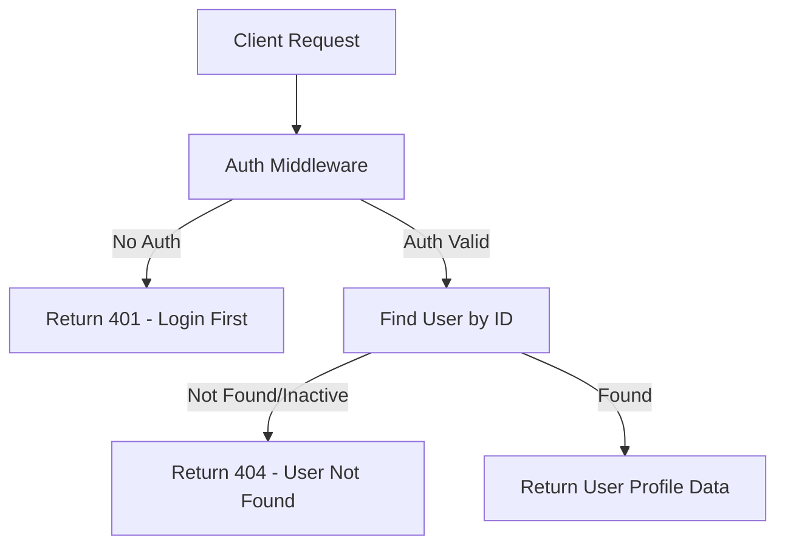

#### 2. Update User Profile (PUT /api/v1/users/profile)

**Description**: Updates authenticated user's profile information with optional avatar upload.

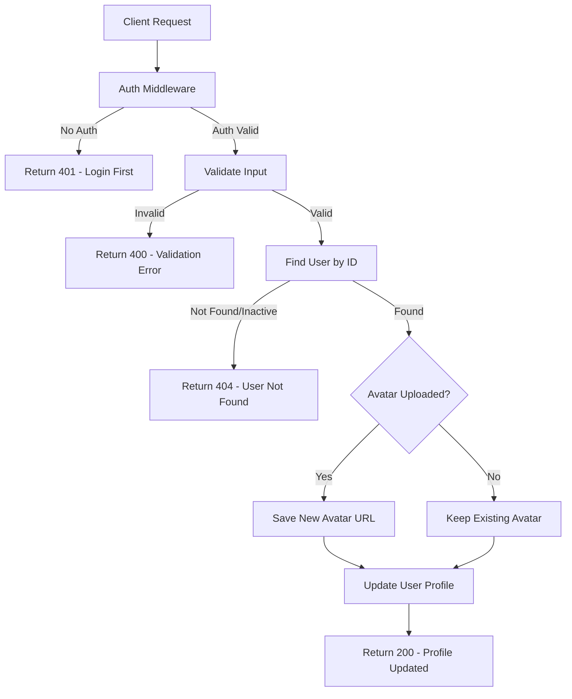

#### 3. Upload Profile Image (POST /api/v1/users/upload-profile-image)

**Description**: Uploads and updates user's profile image.

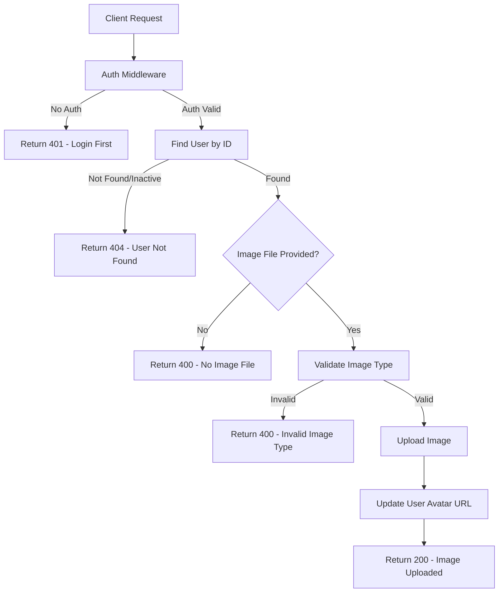

#### 4. Soft Delete User (DELETE /api/v1/users/profile)

**Description**: Soft deletes user account (sets inactive status).

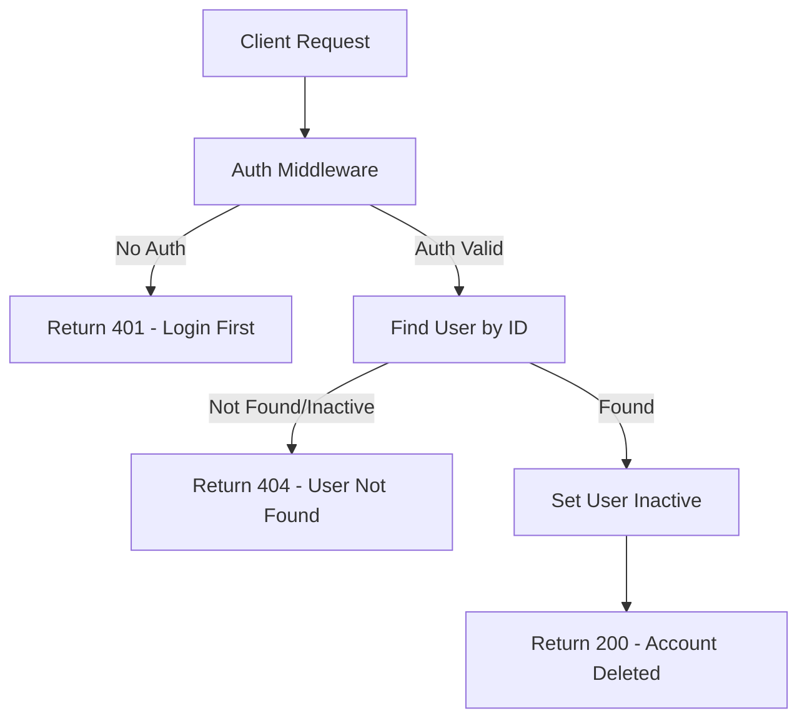

### 🛒 Shopping Cart Flowcharts

#### 1. Add Item to Cart (POST /api/v1/cart)

**Description**: Adds product to user's cart with stock validation and quantity management.

```mermaid
flowchart TD
    A[Client Request] --> B[Auth Middleware]
    B -->|No Auth| C[Return 401 - Login First]
    B -->|Auth Valid| D[Find User by ID]
    D -->|Not Found/Inactive| E[Return 404 - User Not Found]
    D -->|Found| F[Find Product by ID]
    F -->|Not Found/Inactive| G[Return 404 - Product Not Found]
    F -->|Found| H{Quantity Provided?}
    H -->|No| I[Set Quantity = 1]
    H -->|Yes| J[Use Provided Quantity]
    I --> K{Stock Available?}
    J --> K
    K -->|Insufficient| L[Return 404 - Insufficient Stock]
    K -->|Available| M[Check if Item Already in Cart]|
    M -->|Exists| N[Update Quantity]
    M -->|Not Exists| O[Add New Cart Item]
    N --> P{New Total Stock OK?}|
    P -->|Insufficient| Q[Return 404 - Insufficient Stock]|
    P -->|Available| R[Update Cart Item]
    R --> S[Return 200 - Cart Updated]
    O --> T[Create Cart Item]
    T --> U[Return 200 - Item Added]
```

#### 2. Update Cart Quantity (PUT /api/v1/cart/:productId)

**Description**: Updates quantity of existing item in cart.

```mermaid
flowchart TD
    A[Client Request] --> B[Auth Middleware]
    B -->|No Auth| C[Return 401 - Login First]
    B -->|Auth Valid| D[Find User by ID]
    D -->|Not Found/Inactive| E[Return 404 - User Not Found]
    D -->|Found| F[Find Product by ID]
    F -->|Not Found/Inactive| G[Return 404 - Product Not Found]
    F -->|Found| H[Find Cart Item]
    H -->|Not Found| I[Return 404 - Item Not in Cart]
    H -->|Found| J{Quantity Valid?}||
    J -->|Invalid| K[Return 400 - Quantity Must Be >= 1]||
    J -->|Valid| L{Stock Available?}||
    L -->|Insufficient| M[Return 404 - Insufficient Stock]||
    L -->|Available| N[Update Cart Item Quantity]||
    N --> O[Return 200 - Quantity Updated]
```

#### 3. View Cart (GET /api/v1/cart)

**Description**: Retrieves user's cart with product details and cleanup of inactive items.

```mermaid
flowchart TD
    A[Client Request] --> B[Auth Middleware]
    B -->|No Auth| C[Return 401 - Login First]
    B -->|Auth Valid| D[Find User by ID]
    D -->|Not Found/Inactive| E[Return 404 - User Not Found]
    D -->|Found| F[Get User Cart Items]
    F -->|Empty Cart| G[Return 404 - Cart Empty]
    F -->|Has Items| H[Check Each Item's Product Status]|
    H --> I{Inactive Products Found?}|
    I -->|Yes| J[Remove Inactive Items]|
    J --> K{Cart Now Empty?}|
    K -->|Yes| L[Return 404 - Cart Empty After Cleanup]|
    K -->|No| M[Return 200 - Updated Cart]|
    I -->|No| N[Return 200 - Cart Data]|
```

#### 4. Remove Cart Item (DELETE /api/v1/cart/:productId)

**Description**: Removes specific item from user's cart.

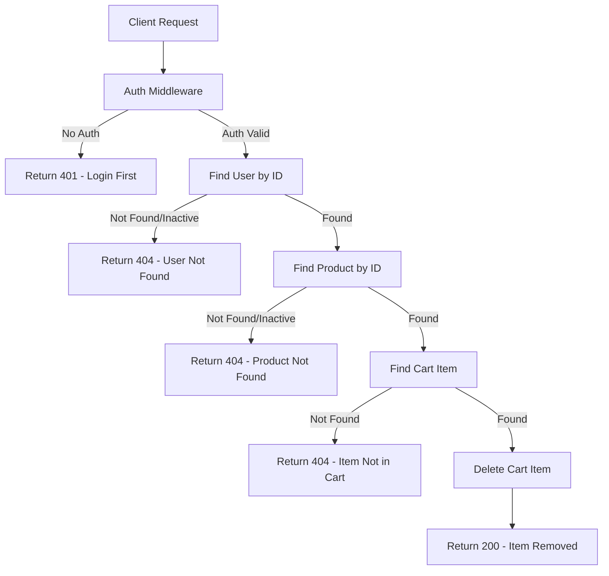

#### 5. Clear Cart (DELETE /api/v1/cart)

**Description**: Removes all items from user's cart.

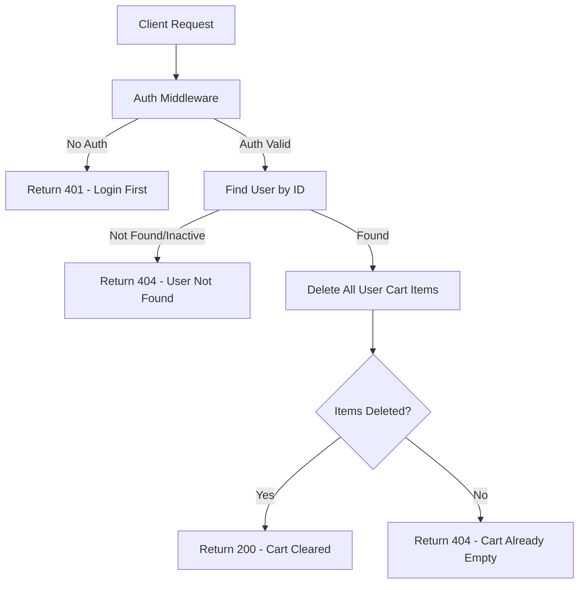

### 📂 Category Management Flowcharts

#### 1. Create Category (POST /api/v1/categories) - Admin Only

**Description**: Creates new product category with optional image upload.

```mermaid
flowchart TD
    A[Client Request] --> B[Auth Middleware]
    B -->|No Auth/Not Admin| C[Return 400 - Admin Only]
    B -->|Admin Auth| D[Validate Input]
    D -->|Invalid| E[Return 400 - Validation Error]
    D -->|Valid| F{Category Image Uploaded?}|
    F -->|Yes| G[Save Image URL]|
    F -->|No| H[Continue Without Image]|
    G --> I[Check Category Name Exists]
    H --> I
    I -->|Exists| J[Return 400 - Category Already Exists]
    I -->|Not Exists| K[Create Category]
    K --> L[Return 200 - Category Created]
```

#### 2. Update Category (PUT /api/v1/categories/:id) - Admin Only

**Description**: Updates existing category with validation and optional image update.

```mermaid
flowchart TD
    A[Client Request] --> B[Auth Middleware]
    B -->|No Auth/Not Admin| C[Return 400 - Admin Only]
    B -->|Admin Auth| D[Validate Input]
    D -->|Invalid| E[Return 400 - Validation Error]
    D -->|Valid| F[Find Category by ID]
    F -->|Not Found| G[Return 404 - Category Not Found]
    F -->|Found| H{Category Image Uploaded?}
    H -->|Yes| I[Save Image URL]
    H -->|No| J[Continue Without Image]
    I --> K[Check Name Exists in Category]|
    J --> K
    K -->|Exists| L[Return 400 - Category Already Exists]|
    K -->|Not Exists| M[Update Category]
    M --> N[Return 200 - Category Updated]
```

#### 3. Delete Category (DELETE /api/v1/categories/:id) - Admin Only

**Description**: Soft deletes category (sets inactive status).

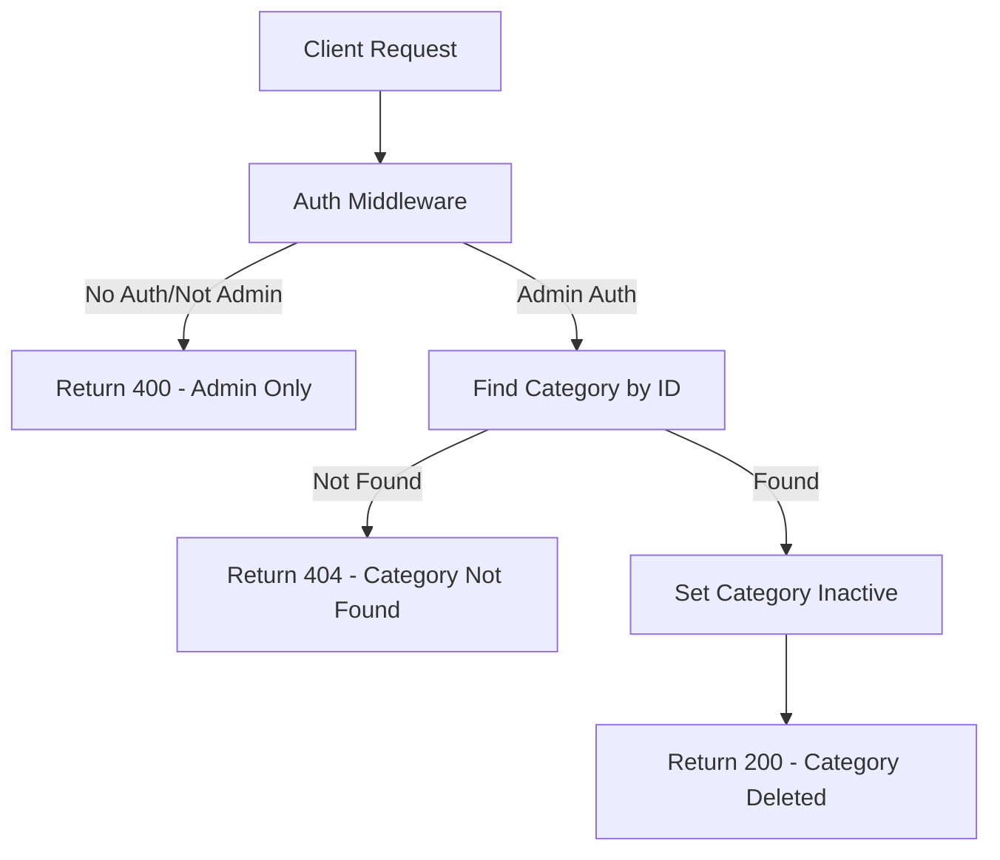

#### 4. Get Categories Admin (GET /api/v1/categories/admin) - Admin Only

**Description**: Retrieves all categories for admin management.

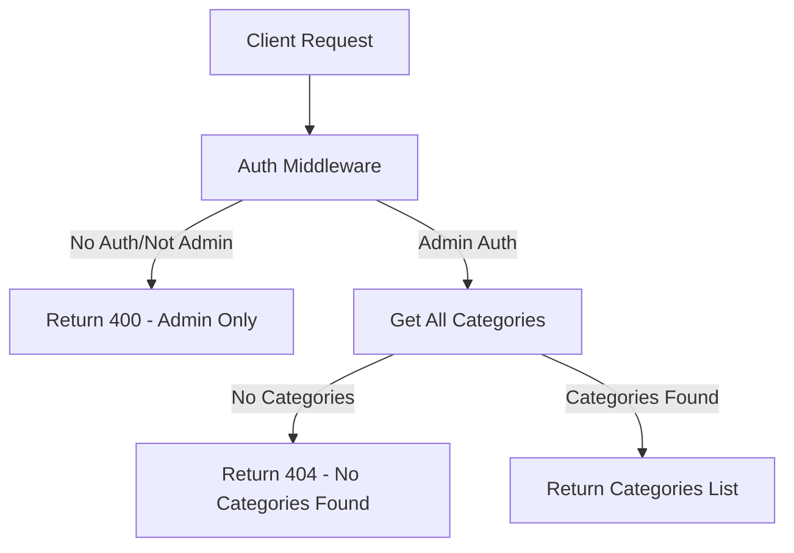

#### 5. Get Single Category Admin (GET /api/v1/categories/:id/admin) - Admin Only

**Description**: Retrieves specific category details for admin.

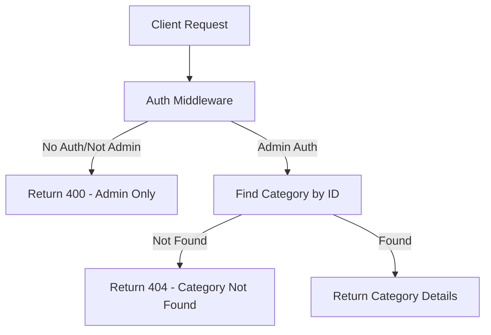

#### 6. Get Categories Public (GET /api/v1/categories) - Public

**Description**: Retrieves all active categories for public viewing.

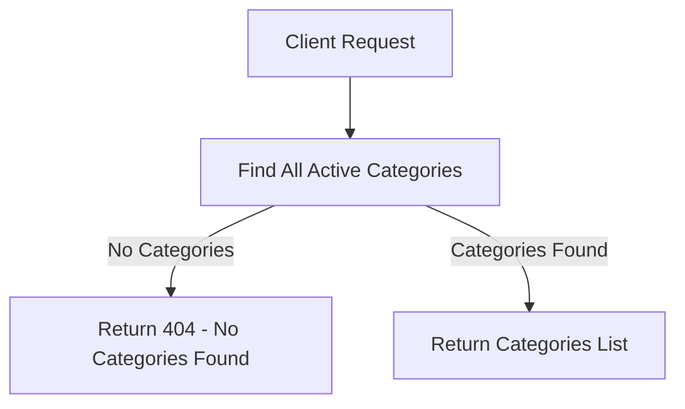

### 🏷️ Subcategory Management Flowcharts

#### 1. Create Subcategory (POST /api/v1/subcategories) - Admin Only

**Description**: Creates new subcategory linked to a parent category.

```mermaid
flowchart TD
    A[Client Request] --> B[Auth Middleware]
    B -->|No Auth/Not Admin| C[Return 400 - Admin Only]
    B -->|Admin Auth| D[Validate Input]
    D -->|Invalid| E[Return 400 - Validation Error]
    D -->|Valid| F{Subcategory Image Uploaded?}|
    F -->|Yes| G[Save Image URL]
    F -->|No| H[Continue Without Image]
    G --> I[Check Name Exists in Category]|
    H --> I
    I -->|Exists| J[Return 400 - Subcategory Already Exists]|
    I -->|Not Exists| K[Create Subcategory]
    K --> L[Return 200 - Subcategory Created]
```

#### 2. Update Subcategory (PUT /api/v1/subcategories/:id) - Admin Only

**Description**: Updates existing subcategory with validation.

```mermaid
flowchart TD
    A[Client Request] --> B[Auth Middleware]
    B -->|No Auth/Not Admin| C[Return 400 - Admin Only]
    B -->|Admin Auth| D[Validate Input]
    D -->|Invalid| E[Return 400 - Validation Error]
    D -->|Valid| F[Find Subcategory by ID]
    F -->|Not Found| G[Return 404 - Subcategory Not Found]
    F -->|Found| H{Subcategory Image Uploaded?}
    H -->|Yes| I[Save Image URL]
    H -->|No| J[Continue Without Image]
    I --> K[Check Name Exists in Category]|
    J --> K
    K -->|Exists| L[Return 400 - Subcategory Already Exists]|
    K -->|Not Exists| M[Update Subcategory]
    M --> N[Return 200 - Subcategory Updated]
```

#### 3. Delete Subcategory (DELETE /api/v1/subcategories/:id) - Admin Only

**Description**: Soft deletes subcategory (sets inactive status).

```mermaid
flowchart TD
    A[Client Request] --> B[Auth Middleware]
    B -->|No Auth/Not Admin| C[Return 400 - Admin Only]
    B -->|Admin Auth| D[Find Subcategory by ID]
    D -->|Not Found| E[Return 404 - Subcategory Not Found]
    D -->|Found| F[Set Subcategory Inactive]
    F --> G[Return 200 - Subcategory Deleted]
```

#### 4. Get All Subcategories Admin (GET /api/v1/subcategories/admin) - Admin Only

**Description**: Retrieves all subcategories for admin management.

```mermaid
flowchart TD
    A[Client Request] --> B[Auth Middleware]
    B -->|No Auth/Not Admin| C[Return 400 - Admin Only]
    B -->|Admin Auth| D[Get All Subcategories]
    D -->|No Subcategories| E[Return 404 - No Subcategories Found]
    D -->|Subcategories Found| F[Return Subcategories List]
```

#### 5. Get Single Subcategory (GET /api/v1/subcategories/:id) - Public

**Description**: Retrieves subcategory details for public viewing.

```mermaid
flowchart TD
    A[Client Request] --> B[Find Subcategory by ID]
    B -->|Not Found/Inactive| C[Return 404 - Subcategory Not Found]
    B -->|Found| D[Return Subcategory Details]
```

### 📦 Product Management Flowcharts

#### 1. Create Product (POST /api/v1/products) - Admin Only

**Description**: Creates new product with comprehensive validation and stock management.

```mermaid
flowchart TD
    A[Client Request] --> B[Auth Middleware]
    B -->|No Auth/Not Admin| C[Return 400 - Admin Only]
    B -->|Admin Auth| D[Validate Input]
    D -->|Invalid| E[Return 400 - Validation Error]
    D -->|Valid| F{Product Image Uploaded?}|
    F -->|Yes| G[Save Image URL]
    F -->|No| H[Continue Without Image]
    G --> I[Check Product Name Exists]
    H --> I
    I -->|Exists| J[Return 400 - Product Already Exists]
    I -->|Not Exists| K[Create Product]
    K --> L[Return 200 - Product Created]
```

#### 2. Update Product (PUT /api/v1/products/:id) - Admin Only

**Description**: Updates existing product with validation and relationship checks.

```mermaid
flowchart TD
    A[Client Request] --> B[Auth Middleware]
    B -->|No Auth/Not Admin| C[Return 400 - Admin Only]
    B -->|Admin Auth| D[Validate Input]
    D -->|Invalid| E[Return 400 - Validation Error]
    D -->|Valid| F[Find Product by ID]
    F -->|Not Found| G[Return 404 - Product Not Found]
    F -->|Found| H{Product Image Uploaded?}
    H -->|Yes| I[Save Image URL]
    H -->|No| J[Continue Without Image]
    I --> K[Check Name Exists in Category]|
    J --> K
    K -->|Exists| L[Return 400 - Product Already Exists]|
    K -->|Not Exists| M[Update Product]
    M --> N[Return 200 - Product Updated]
```

#### 3. Delete Product (DELETE /api/v1/products/:id) - Admin Only

**Description**: Soft deletes product (sets inactive status).

```mermaid
flowchart TD
    A[Client Request] --> B[Auth Middleware]
    B -->|No Auth/Not Admin| C[Return 400 - Admin Only]
    B -->|Admin Auth| D[Find Product by ID]
    D -->|Not Found| E[Return 404 - Product Not Found]
    D -->|Found| F[Set Product Inactive]
    F --> G[Return 200 - Product Deleted]
```

#### 4. Get Products Admin (GET /api/v1/products/admin) - Admin Only

**Description**: Retrieves all products for admin management.

```mermaid
flowchart TD
    A[Client Request] --> B[Auth Middleware]
    B -->|No Auth/Not Admin| C[Return 400 - Admin Only]
    B -->|Admin Auth| D[Get All Products]
    D -->|No Products| E[Return 404 - No Products Found]
    D -->|Products Found| F[Return Products List]
```

#### 5. Get Products (GET /api/v1/products) - Public

**Description**: Retrieves products with filtering, pagination, and search capabilities.

```mermaid
flowchart TD
    A[Client Request] --> B{Filters Provided?}
    B -->|Yes| C[Apply Filters: Category, Price, Search]
    B -->|No| D[Get All Active Products]
    C --> E[Apply Pagination]
    D --> E
    E --> F{Products Found?}
    F -->|No| G[Return 404 - No Products Found]
    F -->|Yes| H[Return Products with Pagination]
```

#### 6. Get Single Product (GET /api/v1/products/:id) - Public

**Description**: Retrieves single product details with category and subcategory information.

```mermaid
flowchart TD
    A[Client Request] --> B[Find Product by ID]
    B -->|Not Found/Inactive| C[Return 404 - Product Not Found]
    B -->|Found| D[Get Category Info]
    D --> E[Get Subcategory Info]
    E --> F[Return Product Details]
```

### 🎫 Coupon Management Flowcharts

#### 1. Create Coupon (POST /api/v1/coupons/admin) - Admin Only

**Description**: Creates new discount coupon with validation rules.

```mermaid
flowchart TD
    A[Client Request] --> B[Auth Middleware]
    B -->|No Auth/Not Admin| C[Return 400 - Admin Only]
    B -->|Admin Auth| D[Validate Input]
    D -->|Invalid| E[Return 400 - Validation Error]
    D -->|Valid| F{Coupon Code Exists?}|
    F -->|Exists| G[Return 400 - Coupon Already Exists]
    F -->|Not Exists| H{Expiry Date Valid?}
    H -->|Invalid| I[Return 400 - Expiry Date Must Be Future]
    H -->|Valid| J{Discount Valid?}
    J -->|Invalid| K[Return 400 - Invalid Discount Amount]
    J -->|Valid| L[Create Coupon]
    L --> M[Return 200 - Coupon Created]
```

#### 2. Update Coupon (PUT /api/v1/coupons/admin) - Admin Only

**Description**: Updates existing coupon with validation.

```mermaid
flowchart TD
    A[Client Request] --> B[Auth Middleware]
    B -->|No Auth/Not Admin| C[Return 400 - Admin Only]
    B -->|Admin Auth| D[Validate Input]
    D -->|Invalid| E[Return 400 - Validation Error]
    D -->|Valid| F[Find Coupon by ID]
    F -->|Not Found| G[Return 404 - Coupon Not Found]
    F -->|Found| H{Coupon Code Changed?}
    H -->|Yes| I[Check New Code Exists]
    H -->|No| J{Expiry Date Valid?}
    I -->|Exists| K[Return 400 - Coupon Already Exists]
    I -->|Not Exists| J
    J -->|Invalid| L[Return 400 - Expiry Date Must Be Future]
    J -->|Valid| M{Discount Valid?}
    M -->|Invalid| N[Return 400 - Invalid Discount Amount]
    M -->|Valid| O[Update Coupon]
    O --> P[Return 200 - Coupon Updated]
```

#### 3. Delete Coupon (DELETE /api/v1/coupons/admin) - Admin Only

**Description**: Deactivates coupon (sets inactive status).

```mermaid
flowchart TD
    A[Client Request] --> B[Auth Middleware]
    B -->|No Auth/Not Admin| C[Return 400 - Admin Only]
    B -->|Admin Auth| D[Find Coupon by ID]
    D -->|Not Found| E[Return 404 - Coupon Not Found]
    D -->|Found| F[Set Coupon Inactive]
    F --> G[Return 200 - Coupon Deactivated]
```

#### 4. Get All Coupons Admin (GET /api/v1/coupons/admin) - Admin Only

**Description**: Retrieves all coupons for admin management.

```mermaid
flowchart TD
    A[Client Request] --> B[Auth Middleware]
    B -->|No Auth/Not Admin| C[Return 400 - Admin Only]
    B -->|Admin Auth| D[Get All Coupons]
    D -->|No Coupons| E[Return 404 - No Coupons Found]
    D -->|Coupons Found| F[Return Coupons List]
```

#### 5. Get Active Coupons (GET /api/v1/coupons) - User

**Description**: Retrieves active coupons available for users.

```mermaid
flowchart TD
    A[Client Request] --> B[Auth Middleware]
    B -->|No Auth| C[Return 401 - Login First]
    B -->|Auth Valid| D[Get Active Non-Expired Coupons]
    D -->|No Coupons| E[Return 404 - No Available Coupons]
    D -->|Coupons Found| F[Return Active Coupons]
```

#### 6. Get Single Coupon User (GET /api/v1/coupons/:id) - User

**Description**: Retrieves specific coupon details for user.

```mermaid
flowchart TD
    A[Client Request] --> B[Auth Middleware]
    B -->|No Auth| C[Return 401 - Login First]
    B -->|Auth Valid| D[Find Coupon by ID]
    D -->|Not Found| E[Return 404 - Coupon Not Found]
    D -->|Found| F{Coupon Active & Not Expired?}
    F -->|No| G[Return 404 - Coupon Not Available]
    F -->|Yes| H[Return Coupon Details]
```

### 📋 Order Management Flowcharts

#### 1. Create Order (POST /checkout) - User

**Description**: Creates order from cart items with payment processing and stock validation.

```mermaid
flowchart TD
    A[Client Request] --> B[Auth Middleware]
    B -->|No Auth| C[Return 401 - Login First]
    B -->|Auth Valid| D[Find User by ID]
    D -->|Not Found/Inactive| E[Return 404 - User Not Found]
    D -->|Found| F[Get User Cart Items]
    F -->|Empty Cart| G[Return 400 - Cart Empty]
    F -->|Has Items| H[Validate Each Item]
    H --> I{All Items Valid?}
    H -->|No| J[Return 400 - Invalid Cart Items]
    H -->|Yes| K{Coupon Code Provided?}
    K -->|Yes| L[Validate Coupon]
    K -->|No| M[Calculate Total Without Discount]
    L -->|Invalid| N[Return 400 - Invalid Coupon]
    L -->|Valid| O[Apply Discount]
    O --> P[Calculate Final Total]
    M --> P
    P --> Q{Payment Method Valid?}
    P -->|No| R[Return 400 - Invalid Payment Method]
    P -->|Yes| S[Check Stock Availability]
    S -->|Insufficient| T[Return 400 - Insufficient Stock]
    S -->|Available| U[Create Order]
    U --> V[Update Product Stock]
    V --> W[Clear User Cart]
    W --> X[Return 200 - Order Created]
```

#### 2. Get User Orders (GET /) - User

**Description**: Retrieves authenticated user's order history.

```mermaid
flowchart TD
    A[Client Request] --> B[Auth Middleware]
    B -->|No Auth| C[Return 401 - Login First]
    B -->|Auth Valid| D[Find User by ID]
    D -->|Not Found/Inactive| E[Return 404 - User Not Found]
    D -->|Found| F[Get User Orders]
    F -->|No Orders| G[Return 404 - No Orders Found]
    F -->|Orders Found| H[Return Orders List]
```

#### 3. Get Single Order (GET /:id) - User

**Description**: Retrieves specific order details for user.

```mermaid
flowchart TD
    A[Client Request] --> B[Auth Middleware]
    B -->|No Auth| C[Return 401 - Login First]
    B -->|Auth Valid| D[Find Order by ID]
    D -->|Not Found| E[Return 404 - Order Not Found]
    D -->|Found| F{Order Belongs to User?}
    F -->|No| G[Return 403 - Access Denied]
    F -->|Yes| H[Return Order Details]
```

#### 4. Get All Orders Admin (GET /admin) - Admin Only

**Description**: Retrieves all orders for admin management.

```mermaid
flowchart TD
    A[Client Request] --> B[Auth Middleware]
    B -->|No Auth/Not Admin| C[Return 400 - Admin Only]
    B -->|Admin Auth| D[Get All Orders]
    D -->|No Orders| E[Return 404 - No Orders Found]
    D -->|Orders Found| F[Return Orders List]
```

#### 5. Update Order Status (PATCH /admin/:id/status) - Admin Only

**Description**: Updates order status with validation.

```mermaid
flowchart TD
    A[Client Request] --> B[Auth Middleware]
    B -->|No Auth/Not Admin| C[Return 400 - Admin Only]
    B -->|Admin Auth| D[Validate Input]
    D -->|Invalid| E[Return 400 - Validation Error]
    D -->|Valid| F[Find Order by ID]
    F -->|Not Found| G[Return 404 - Order Not Found]
    F -->|Found| H{Status Valid?}
    H -->|No| I[Return 400 - Invalid Status]
    H -->|Yes| J{Status Transition Valid?}
    J -->|No| K[Return 400 - Invalid Status Transition]
    J -->|Yes| L[Update Order Status]
    L --> M[Return 200 - Status Updated]
```

### 👥 Staff Management Flowcharts

#### 1. Add Staff (POST /api/v1/staff/admin) - Admin Only

**Description**: Adds new staff member with role assignment.

```mermaid
flowchart TD
    A[Client Request] --> B[Auth Middleware]
    B -->|No Auth/Not Admin| C[Return 400 - Admin Only]
    B -->|Admin Auth| D[Validate Input]
    D -->|Invalid| E[Return 400 - Validation Error]
    D -->|Valid| F{Email Already Exists?}
    F -->|Yes| G[Return 400 - Email Already Exists]
    F -->|No| H[Hash Password]
    H --> I[Create Staff Account]
    I --> J[Return 200 - Staff Added]
```

#### 2. Update Staff (PUT /api/v1/staff/admin/:id) - Admin Only

**Description**: Updates staff member information.

```mermaid
flowchart TD
    A[Client Request] --> B[Auth Middleware]
    B -->|No Auth/Not Admin| C[Return 400 - Admin Only]
    B -->|Admin Auth| D[Validate Input]
    D -->|Invalid| E[Return 400 - Validation Error]
    D -->|Valid| F[Find Staff by ID]
    F -->|Not Found| G[Return 404 - Staff Not Found]
    F -->|Found| H{Email Changed?}
    H -->|Yes| I[Check New Email Exists]
    H -->|No| J[Update Staff Info]
    I -->|Exists| K[Return 400 - Email Already Exists]
    I -->|Not Exists| J
    J --> L[Return 200 - Staff Updated]
```

#### 3. Staff Check-in (POST /api/v1/staff/check-in) - Staff Only

**Description**: Records staff attendance check-in.

```mermaid
flowchart TD
    A[Client Request] --> B[Auth Middleware]
    B -->|No Auth/Not Staff| C[Return 401 - Staff Only]
    B -->|Staff Auth| D[Find Staff by ID]
    D -->|Not Found/Inactive| E[Return 404 - Staff Not Found]
    D -->|Found| F{Already Checked In Today?}
    F -->|Yes| G[Return 400 - Already Checked In]
    F -->|No| H[Create Check-in Record]
    H --> I[Return 200 - Check-in Successful]
```

#### 4. Staff Check-out (POST /api/v1/staff/check-out) - Staff Only

**Description**: Records staff attendance check-out.

```mermaid
flowchart TD
    A[Client Request] --> B[Auth Middleware]
    B -->|No Auth/Not Staff| C[Return 401 - Staff Only]
    B -->|Staff Auth| D[Find Staff by ID]
    D -->|Not Found/Inactive| E[Return 404 - Staff Not Found]
    D -->|Found| F{Checked In Today?}
    F -->|No| G[Return 400 - Not Checked In]
    F -->|Yes| H{Already Checked Out?}
    H -->|Yes| I[Return 400 - Already Checked Out]
    H -->|No| J[Update Check-out Time]
    J --> K[Return 200 - Check-out Successful]
```

#### 5. Add Staff Deduction (POST /api/v1/staff/admin/:id/deductions) - Admin Only

**Description**: Adds salary deduction for staff member.

```mermaid
flowchart TD
    A[Client Request] --> B[Auth Middleware]
    B -->|No Auth/Not Admin| C[Return 400 - Admin Only]
    B -->|Admin Auth| D[Validate Input]
    D -->|Invalid| E[Return 400 - Validation Error]
    D -->|Valid| F[Find Staff by ID]
    F -->|Not Found| G[Return 404 - Staff Not Found]
    F -->|Found| H{Amount Valid?}|
    H -->|No| I[Return 400 - Invalid Amount]|
    H -->|Yes| J[Create Deduction Record]|
    J --> K[Return 200 - Deduction Added]
```

### Flowchart Legend

- **Rectangles**: Process/Action steps
- **Diamonds**: Decision points (Yes/No branches)
- **Parallelograms**: Input/Output operations
- **Cylinders**: Database operations
- **Colors**:
  - 🟢 Green: Success paths
  - 🔴 Red: Error paths
  - 🔵 Blue: Authentication/Authorization
  - 🟠 Orange: Validation

## 🛡️ Security Features

- **Password Hashing**: bcrypt with configurable salt rounds
- **JWT Authentication**: Secure token-based authentication
- **Input Validation**: Joi schemas for all API inputs
- **Role-based Access Control**: Middleware for authorization
- **Email Verification**: Account activation required
- **Rate Limiting**: Protection against brute force attacks
- **File Upload Security**: Multer with file type validation

## 🧪 Testing

Run the test suite:

```bash
# Run all tests
npm test

# Run tests in watch mode
npm run test:watch

# Generate coverage report
npm run test:coverage
```

## 📝 API Documentation

### Base URL

```
http://localhost:3000/api/v1
```

### Common Response Format

**Success Response (200/201):**

```json
{
  "message": "Success message",
  "data": { ... }
}
```

**Error Response (4xx/5xx):**

```json
{
  "message": "Error description",
  "status": 400
}
```

### Authentication Endpoints

| Method | Endpoint                          | Description               | Auth Required |
| ------ | --------------------------------- | ------------------------- | ------------- |
| POST   | `/auth/signup`                    | User registration         | No            |
| POST   | `/auth/login`                     | User login                | No            |
| GET    | `/auth/verify-email/:token`       | Email verification        | No            |
| POST   | `/auth/resend-verification`       | Resend verification email | No            |
| POST   | `/auth/forget-password`           | Request password reset    | No            |
| POST   | `/auth/reset-password`            | Reset password with OTP   | No            |
| POST   | `/auth/generate-new-access-token` | Refresh access token      | No            |

### User Management Endpoints

| Method | Endpoint                      | Description          | Auth Required |
| ------ | ----------------------------- | -------------------- | ------------- |
| GET    | `/users/profile`              | Get user profile     | User          |
| PUT    | `/users/profile`              | Update user profile  | User          |
| DELETE | `/users/profile`              | Soft delete user     | User          |
| POST   | `/users/upload-profile-image` | Upload profile image | User          |

### Category Management Endpoints

| Method | Endpoint                        | Description                   | Auth Required |
| ------ | ------------------------------- | ----------------------------- | ------------- |
| POST   | `/categories`                   | Create category               | Admin         |
| PUT    | `/categories/:id`               | Update category               | Admin         |
| DELETE | `/categories/:id`               | Soft delete category          | Admin         |
| GET    | `/categories/admin`             | Get all categories            | Admin         |
| GET    | `/categories/:id/admin`         | Get one category              | Admin         |
| GET    | `/categories`                   | Get active categories         | Public        |
| GET    | `/categories/:id/subcategories` | Get subcategories by category | Public        |

### Product Management Endpoints

| Method | Endpoint          | Description               | Auth Required |
| ------ | ----------------- | ------------------------- | ------------- |
| POST   | `/products`       | Add product               | Admin         |
| PUT    | `/products/:id`   | Update product            | Admin         |
| DELETE | `/products/:id`   | Soft delete product       | Admin         |
| GET    | `/products/admin` | Get all products          | Admin         |
| GET    | `/products`       | Get products with filters | Public        |
| GET    | `/products/:id`   | Get one product           | Public        |

### Shopping Cart Endpoints

| Method | Endpoint           | Description           | Auth Required |
| ------ | ------------------ | --------------------- | ------------- |
| POST   | `/cart`            | Add item to cart      | User          |
| PUT    | `/cart/:productId` | Update item quantity  | User          |
| GET    | `/cart`            | View cart             | User          |
| DELETE | `/cart/:productId` | Remove item from cart | User          |
| DELETE | `/cart`            | Clear cart            | User          |

### Order Management Endpoints

| Method | Endpoint            | Description         | Auth Required |
| ------ | ------------------- | ------------------- | ------------- |
| POST   | `/checkout`         | Create order        | User          |
| GET    | `/`                 | Get user orders     | User          |
| GET    | `/:id`              | Get single order    | User          |
| GET    | `/admin`            | Get all orders      | Admin         |
| PATCH  | `/admin/:id/status` | Update order status | Admin         |

### Staff Management Endpoints

| Method | Endpoint                                   | Description          | Auth Required |
| ------ | ------------------------------------------ | -------------------- | ------------- |
| GET    | `/staff/admin`                             | Get all staff        | Admin         |
| POST   | `/staff/admin`                             | Add staff            | Admin         |
| GET    | `/staff/admin/:id`                         | Get staff details    | Admin         |
| PUT    | `/staff/admin/:id`                         | Update staff         | Admin         |
| DELETE | `/staff/admin/:id`                         | Soft delete staff    | Admin         |
| POST   | `/staff/check-in`                          | Staff check in       | Staff         |
| POST   | `/staff/check-out`                         | Staff check out      | Staff         |
| POST   | `/staff/admin/:id/deductions`              | Add deduction        | Admin         |
| GET    | `/staff/admin/:id/deductions`              | Get staff deductions | Admin         |
| PUT    | `/staff/admin/:id/deductions/:deductionId` | Update deduction     | Admin         |
| DELETE | `/staff/admin/:id/deductions/:deductionId` | Remove deduction     | Admin         |

### Coupon Management Endpoints

| Method | Endpoint             | Description              | Auth Required |
| ------ | -------------------- | ------------------------ | ------------- |
| POST   | `/coupons/admin`     | Add coupon               | Admin         |
| GET    | `/coupons/admin`     | Get all coupons          | Admin         |
| GET    | `/coupons/admin/:id` | Get one coupon           | Admin         |
| PUT    | `/coupons/admin`     | Update coupon            | Admin         |
| DELETE | `/coupons/admin`     | Delete/deactivate coupon | Admin         |
| GET    | `/coupons`           | Get all coupons          | User          |
| GET    | `/coupons/:id`       | Get one coupon           | User          |

## 🔧 Development

### Code Style

- ES6+ JavaScript with modules
- RESTful API design principles
- MVC (Model-View-Controller) pattern
- Middleware-based architecture
- Comprehensive error handling

### Database Schema

The application uses MongoDB with the following main collections:

- **users**: User accounts and profiles
- **categories**: Product categories
- **subcategories**: Product subcategories
- **products**: Product catalog
- **carts**: Shopping cart items
- **orders**: Order records
- **staff**: Staff management
- **coupons**: Discount codes

### Environment Variables

| Variable            | Description                  | Default                                  |
| ------------------- | ---------------------------- | ---------------------------------------- |
| PORT                | Server port                  | 3000                                     |
| EMAIL               | SMTP email address           | -                                        |
| PASSWORD            | SMTP app password            | -                                        |
| HASH                | bcrypt salt rounds           | 12                                       |
| BASE_URL            | Application base URL         | http://localhost:3000                    |
| SIGNATURE_ADMIN     | Admin JWT signature          | signatureAdmin                           |
| SIGNATURE_USER      | User JWT signature           | signatureUser                            |
| SIGNATURE_STAFF     | Staff JWT signature          | signatureStaff                           |
| ACCESS_TOKEN        | Access token expiry          | 1d                                       |
| REFRESH_TOKEN       | Refresh token expiry         | 1y                                       |
| DATA_BASE_URL_MY    | MongoDB connection string    | mongodb://localhost:27017/e-commerce-nti |
| VERIFY_SIGNATURE_MY | Email verification signature | my                                       |

## 🚀 Deployment

### Production Setup

1. **Set Environment Variables**

   ```bash
   export NODE_ENV=production
   export PORT=3000
   # Set all other required environment variables
   ```

2. **Database Setup**
   - Configure MongoDB connection string
   - Ensure database indexes are created
   - Set up database backups

3. **File Upload Storage**
   - Configure upload directory permissions
   - Set up CDN for production if needed

4. **Email Service**
   - Configure SMTP settings
   - Set up email templates

5. **Start Application**
   ```bash
   npm start
   ```

### Docker Deployment

```dockerfile
FROM node:18-alpine
WORKDIR /app
COPY package*.json ./
RUN npm ci --only=production
COPY . .
EXPOSE 3000
CMD ["npm", "start"]
```

## 🤝 Contributing

1. Fork the repository
2. Create a feature branch (`git checkout -b feature/amazing-feature`)
3. Commit your changes (`git commit -m 'Add some amazing feature'`)
4. Push to the branch (`git push origin feature/amazing-feature`)
5. Open a Pull Request

## 📄 License

This project is licensed under the ISC License - see the package.json file for details.

## 📞 Support

For support and questions:

- Email: youssefbenyamine2eme@gmail.com
- GitHub Issues: [Create an issue](https://github.com/your-username/e-commerce-backend/issues)

## 🙏 Acknowledgments

- Node.js and Express.js communities
- MongoDB and Mongoose documentation
- JWT authentication best practices
- Open source contributors
