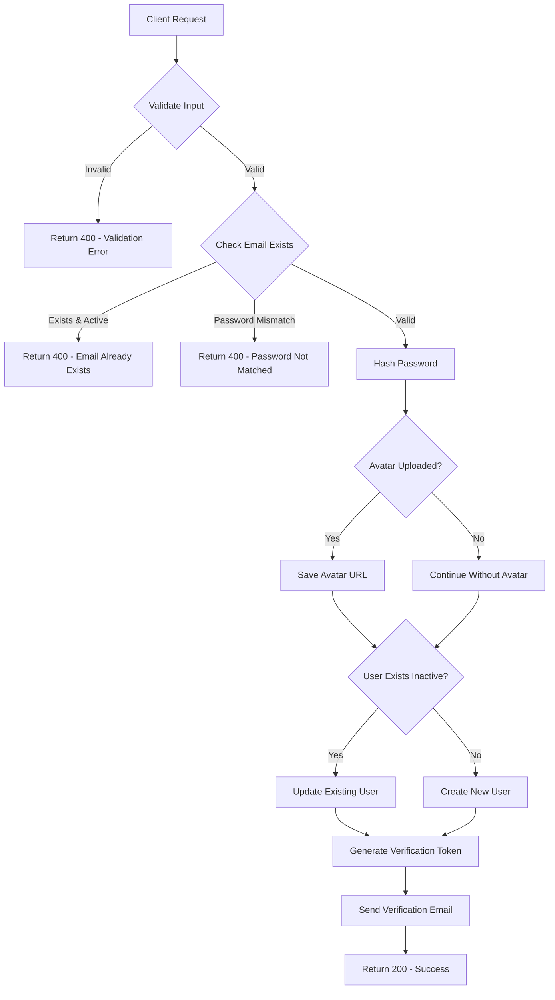
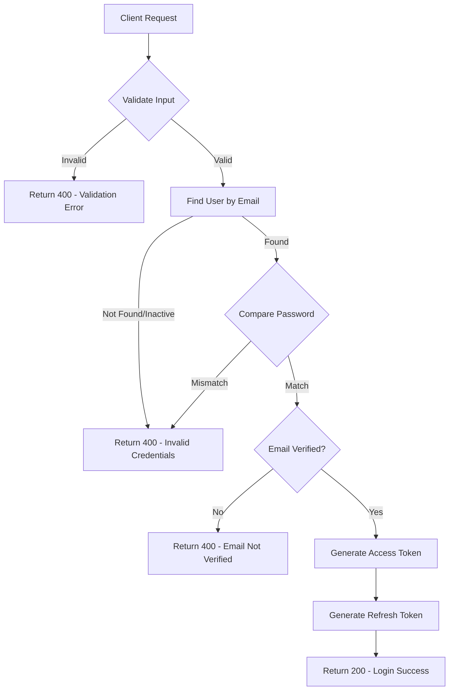
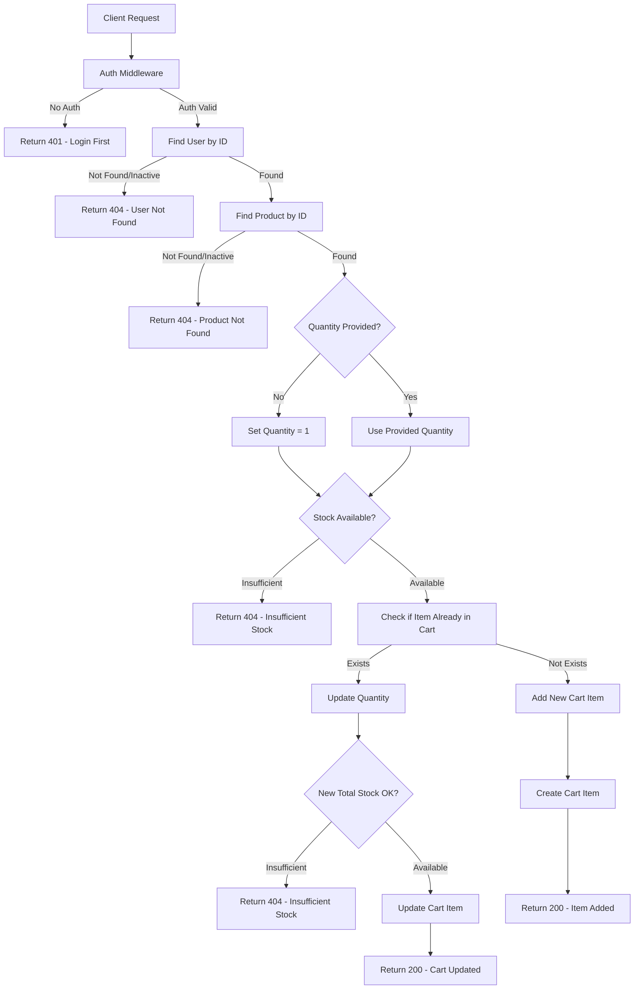
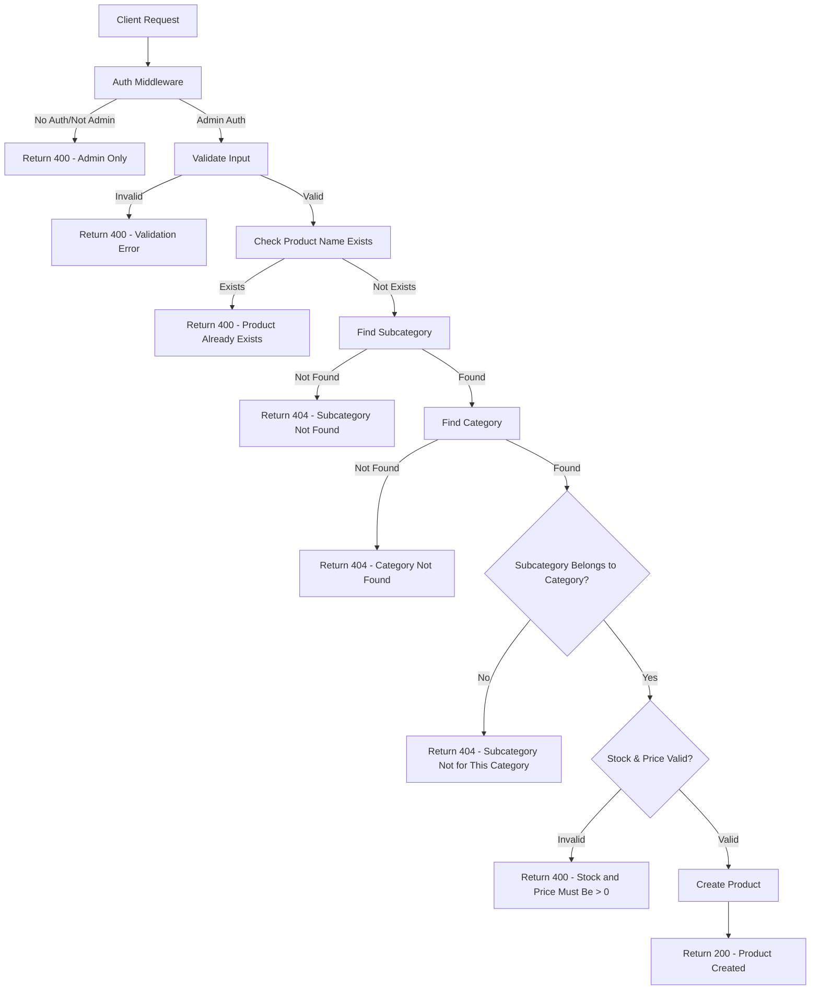

# E-Commerce Backend API

A comprehensive Node.js and Express.js backend API for an e-commerce platform with user authentication, product management, cart functionality, order processing, and admin features.

## 🚀 Features

- **User Management**: Registration, login, email verification, password reset
- **Product Catalog**: Categories, subcategories, products with image uploads
- **Shopping Cart**: Add, update, remove items with stock validation
- **Order Management**: Order creation, status tracking, admin order management
- **Admin Panel**: Staff management, user management, product/category management
- **Coupon System**: Discount coupons for users
- **Authentication & Authorization**: JWT-based auth with role-based access control
- **Email Services**: Verification emails, password reset, notifications

## 🛠️ Tech Stack

- **Runtime**: Node.js with ES6 Modules
- **Framework**: Express.js 5.2.1
- **Database**: MongoDB with Mongoose ODM
- **Authentication**: JWT (JSON Web Tokens)
- **Validation**: Joi for input validation
- **File Upload**: Multer for image handling
- **Email**: Nodemailer for email services
- **Password Hashing**: bcrypt
- **Testing**: Jest with Supertest
- **Documentation**: Mermaid flowcharts for API documentation

## 📋 Prerequisites

- Node.js (v16 or higher)
- MongoDB (local or cloud instance)
- npm or yarn package manager

## 🚀 Quick Start

1. **Clone the repository**

   ```bash
   git clone <repository-url>
   cd e-commerce-backend
   ```

2. **Install dependencies**

   ```bash
   npm install
   ```

3. **Environment Setup**

   Copy the environment configuration and update as needed:

   ```bash
   cp config/.env.example config/.env
   ```

   Update the following variables in `config/.env`:

   ```env
   PORT = 3000
   EMAIL = your-email@gmail.com
   PASSWORD = your-app-password
   HASH = 12
   BASE_URL = http://localhost:3000
   SIGNATURE_ADMIN = signatureAdmin
   SIGNATURE_USER = signatureUser
   SIGNATURE_STAFF = signatureStaff
   ACCESS_TOKEN = 1d
   REFRESH_TOKEN = 1y
   DATA_BASE_URL_MY = mongodb://localhost:27017/e-commerce-nti
   VERIFY_SIGNATURE_MY = my
   ```

4. **Start MongoDB**

   ```bash
   # For local MongoDB
   mongod
   ```

5. **Run the application**

   ```bash
   # Development mode with auto-restart
   npm start

   # Or run directly
   node src/main.js
   ```

6. **Access the API**
   The server will start on `http://localhost:3000`

## 📁 Project Structure

```
├── src/
│   ├── app.controller.js          # Main Express app setup
│   ├── main.js                    # Application entry point
│   ├── common/                    # Shared utilities and middleware
│   │   ├── middleware/            # Express middleware
│   │   └── utils/                 # Utility functions
│   ├── database/                  # Database configuration
│   │   ├── connection.js          # MongoDB connection
│   │   └── model/                 # Mongoose models
│   └── module/                    # Feature modules
│       ├── auth/                  # Authentication
│       ├── users/                 # User management
│       ├── categories/            # Product categories
│       ├── subCategories/         # Subcategories
│       ├── products/              # Product management
│       ├── carts/                 # Shopping cart
│       ├── orders/                # Order processing
│       ├── staffs/                # Staff management
│       └── coupons/               # Coupon system
├── config/                        # Configuration files
├── flowcharts/                    # API documentation with flowcharts
├── uploads/                       # File upload directory
└── tests/                         # Test files
```

## 🔐 Authentication & Authorization

The API uses JWT-based authentication with three user roles:

- **User**: Regular customers with shopping and order capabilities
- **Admin**: Full system access including user and product management
- **Staff**: Limited access for order processing and customer service

### Authentication Flow

1. **Login**: User provides credentials → JWT tokens generated
2. **Access Token**: Short-lived token for API requests (1 day)
3. **Refresh Token**: Long-lived token for token renewal (1 year)
4. **Role-based Access**: Middleware checks user role for protected endpoints

## 📊 API Flowcharts

This project includes comprehensive API flowcharts in the `flowcharts/` directory. Each flowchart visually represents the API logic, including validation, business rules, error handling, and success paths.

### 🔐 Authentication Flowcharts

#### User Registration Flow



#### User Login Flow



### Shopping Cart Flowcharts

#### Add Item to Cart Flow



### Product Management Flowcharts

#### Create Product Flow (Admin Only)



### Available Flowcharts

The complete flowcharts are available in the `flowcharts/` directory:

#### 1. Authentication APIs

- **User Registration**: Complete signup flow with email verification
- **User Login**: Authentication with token generation
- **Email Verification**: Token-based email verification
- **Password Reset**: OTP-based password recovery
- **Token Refresh**: Access token renewal

#### 2. User Management APIs

- **Profile Management**: View, update, and delete user profiles
- **Profile Image Upload**: Avatar management

#### 3. Product Management APIs

- **Product CRUD**: Create, read, update, delete products (admin only)
- **Category Management**: Category and subcategory operations
- **Product Search**: Filtered product browsing

#### 4. Shopping Cart APIs

- **Cart Operations**: Add, update, remove items
- **Stock Validation**: Real-time stock checking
- **Cart Management**: View and clear cart

#### 5. Order Management APIs

- **Order Creation**: Checkout process with cart items
- **Order Tracking**: Status updates and history
- **Admin Order Management**: Order processing and fulfillment

#### 6. Staff Management APIs

- **Staff CRUD**: Staff member management
- **Check-in/Check-out**: Attendance tracking
- **Deduction Management**: Salary deductions

#### 7. Coupon System APIs

- **Coupon Management**: Create and manage discount codes
- **Coupon Application**: Apply discounts to orders

### How to View Flowcharts

The flowcharts are written in Mermaid syntax and can be viewed using:

- **GitHub/GitLab**: Automatic Mermaid rendering
- **VS Code**: Install Mermaid Preview extension
- **Online**: Use [mermaid.live](https://mermaid.live) or [Mermaid.js](https://mermaid-js.github.io)
- **Markdown Editors**: Most modern editors support Mermaid

### Flowchart Legend

- **Rectangles**: Process/Action steps
- **Diamonds**: Decision points (Yes/No branches)
- **Parallelograms**: Input/Output operations
- **Cylinders**: Database operations
- **Colors**:
  - 🟢 Green: Success paths
  - 🔴 Red: Error paths
  - 🔵 Blue: Authentication/Authorization
  - 🟠 Orange: Validation

## 🛡️ Security Features

- **Password Hashing**: bcrypt with configurable salt rounds
- **JWT Authentication**: Secure token-based authentication
- **Input Validation**: Joi schemas for all API inputs
- **Role-based Access Control**: Middleware for authorization
- **Email Verification**: Account activation required
- **Rate Limiting**: Protection against brute force attacks
- **File Upload Security**: Multer with file type validation

## 🧪 Testing

Run the test suite:

```bash
# Run all tests
npm test

# Run tests in watch mode
npm run test:watch

# Generate coverage report
npm run test:coverage
```

## 📝 API Documentation

### Base URL

```
http://localhost:3000/api/v1
```

### Common Response Format

**Success Response (200/201):**

```json
{
  "message": "Success message",
  "data": { ... }
}
```

**Error Response (4xx/5xx):**

```json
{
  "message": "Error description",
  "status": 400
}
```

### Authentication Endpoints

| Method | Endpoint                          | Description               | Auth Required |
| ------ | --------------------------------- | ------------------------- | ------------- |
| POST   | `/auth/signup`                    | User registration         | No            |
| POST   | `/auth/login`                     | User login                | No            |
| GET    | `/auth/verify-email/:token`       | Email verification        | No            |
| POST   | `/auth/resend-verification`       | Resend verification email | No            |
| POST   | `/auth/forget-password`           | Request password reset    | No            |
| POST   | `/auth/reset-password`            | Reset password with OTP   | No            |
| POST   | `/auth/generate-new-access-token` | Refresh access token      | No            |

### User Management Endpoints

| Method | Endpoint                      | Description          | Auth Required |
| ------ | ----------------------------- | -------------------- | ------------- |
| GET    | `/users/profile`              | Get user profile     | User          |
| PUT    | `/users/profile`              | Update user profile  | User          |
| DELETE | `/users/profile`              | Soft delete user     | User          |
| POST   | `/users/upload-profile-image` | Upload profile image | User          |

### Category Management Endpoints

| Method | Endpoint                        | Description                   | Auth Required |
| ------ | ------------------------------- | ----------------------------- | ------------- |
| POST   | `/categories`                   | Create category               | Admin         |
| PUT    | `/categories/:id`               | Update category               | Admin         |
| DELETE | `/categories/:id`               | Soft delete category          | Admin         |
| GET    | `/categories/admin`             | Get all categories            | Admin         |
| GET    | `/categories/:id/admin`         | Get one category              | Admin         |
| GET    | `/categories`                   | Get active categories         | Public        |
| GET    | `/categories/:id/subcategories` | Get subcategories by category | Public        |

### Product Management Endpoints

| Method | Endpoint          | Description               | Auth Required |
| ------ | ----------------- | ------------------------- | ------------- |
| POST   | `/products`       | Add product               | Admin         |
| PUT    | `/products/:id`   | Update product            | Admin         |
| DELETE | `/products/:id`   | Soft delete product       | Admin         |
| GET    | `/products/admin` | Get all products          | Admin         |
| GET    | `/products`       | Get products with filters | Public        |
| GET    | `/products/:id`   | Get one product           | Public        |

### Shopping Cart Endpoints

| Method | Endpoint           | Description           | Auth Required |
| ------ | ------------------ | --------------------- | ------------- |
| POST   | `/cart`            | Add item to cart      | User          |
| PUT    | `/cart/:productId` | Update item quantity  | User          |
| GET    | `/cart`            | View cart             | User          |
| DELETE | `/cart/:productId` | Remove item from cart | User          |
| DELETE | `/cart`            | Clear cart            | User          |

### Order Management Endpoints

| Method | Endpoint            | Description         | Auth Required |
| ------ | ------------------- | ------------------- | ------------- |
| POST   | `/checkout`         | Create order        | User          |
| GET    | `/`                 | Get user orders     | User          |
| GET    | `/:id`              | Get single order    | User          |
| GET    | `/admin`            | Get all orders      | Admin         |
| PATCH  | `/admin/:id/status` | Update order status | Admin         |

### Staff Management Endpoints

| Method | Endpoint                                   | Description          | Auth Required |
| ------ | ------------------------------------------ | -------------------- | ------------- |
| GET    | `/staff/admin`                             | Get all staff        | Admin         |
| POST   | `/staff/admin`                             | Add staff            | Admin         |
| GET    | `/staff/admin/:id`                         | Get staff details    | Admin         |
| PUT    | `/staff/admin/:id`                         | Update staff         | Admin         |
| DELETE | `/staff/admin/:id`                         | Soft delete staff    | Admin         |
| POST   | `/staff/check-in`                          | Staff check in       | Staff         |
| POST   | `/staff/check-out`                         | Staff check out      | Staff         |
| POST   | `/staff/admin/:id/deductions`              | Add deduction        | Admin         |
| GET    | `/staff/admin/:id/deductions`              | Get staff deductions | Admin         |
| PUT    | `/staff/admin/:id/deductions/:deductionId` | Update deduction     | Admin         |
| DELETE | `/staff/admin/:id/deductions/:deductionId` | Remove deduction     | Admin         |

### Coupon Management Endpoints

| Method | Endpoint             | Description              | Auth Required |
| ------ | -------------------- | ------------------------ | ------------- |
| POST   | `/coupons/admin`     | Add coupon               | Admin         |
| GET    | `/coupons/admin`     | Get all coupons          | Admin         |
| GET    | `/coupons/admin/:id` | Get one coupon           | Admin         |
| PUT    | `/coupons/admin`     | Update coupon            | Admin         |
| DELETE | `/coupons/admin`     | Delete/deactivate coupon | Admin         |
| GET    | `/coupons`           | Get all coupons          | User          |
| GET    | `/coupons/:id`       | Get one coupon           | User          |

## 🔧 Development

### Code Style

- ES6+ JavaScript with modules
- RESTful API design principles
- MVC (Model-View-Controller) pattern
- Middleware-based architecture
- Comprehensive error handling

### Database Schema

The application uses MongoDB with the following main collections:

- **users**: User accounts and profiles
- **categories**: Product categories
- **subcategories**: Product subcategories
- **products**: Product catalog
- **carts**: Shopping cart items
- **orders**: Order records
- **staff**: Staff management
- **coupons**: Discount codes

### Environment Variables

| Variable            | Description                  | Default                                  |
| ------------------- | ---------------------------- | ---------------------------------------- |
| PORT                | Server port                  | 3000                                     |
| EMAIL               | SMTP email address           | -                                        |
| PASSWORD            | SMTP app password            | -                                        |
| HASH                | bcrypt salt rounds           | 12                                       |
| BASE_URL            | Application base URL         | http://localhost:3000                    |
| SIGNATURE_ADMIN     | Admin JWT signature          | signatureAdmin                           |
| SIGNATURE_USER      | User JWT signature           | signatureUser                            |
| SIGNATURE_STAFF     | Staff JWT signature          | signatureStaff                           |
| ACCESS_TOKEN        | Access token expiry          | 1d                                       |
| REFRESH_TOKEN       | Refresh token expiry         | 1y                                       |
| DATA_BASE_URL_MY    | MongoDB connection string    | mongodb://localhost:27017/e-commerce-nti |
| VERIFY_SIGNATURE_MY | Email verification signature | my                                       |

## 🚀 Deployment

### Production Setup

1. **Set Environment Variables**

   ```bash
   export NODE_ENV=production
   export PORT=3000
   # Set all other required environment variables
   ```

2. **Database Setup**
   - Configure MongoDB connection string
   - Ensure database indexes are created
   - Set up database backups

3. **File Upload Storage**
   - Configure upload directory permissions
   - Set up CDN for production if needed

4. **Email Service**
   - Configure SMTP settings
   - Set up email templates

5. **Start Application**
   ```bash
   npm start
   ```

### Docker Deployment

```dockerfile
FROM node:18-alpine
WORKDIR /app
COPY package*.json ./
RUN npm ci --only=production
COPY . .
EXPOSE 3000
CMD ["npm", "start"]
```

## 🤝 Contributing

1. Fork the repository
2. Create a feature branch (`git checkout -b feature/amazing-feature`)
3. Commit your changes (`git commit -m 'Add some amazing feature'`)
4. Push to the branch (`git push origin feature/amazing-feature`)
5. Open a Pull Request

## 📄 License

This project is licensed under the ISC License - see the package.json file for details.

## 📞 Support

For support and questions:

- Email: youssefbenyamine2eme@gmail.com
- GitHub Issues: [Create an issue](https://github.com/your-username/e-commerce-backend/issues)

## 🙏 Acknowledgments

- Node.js and Express.js communities
- MongoDB and Mongoose documentation
- JWT authentication best practices
- Open source contributors
