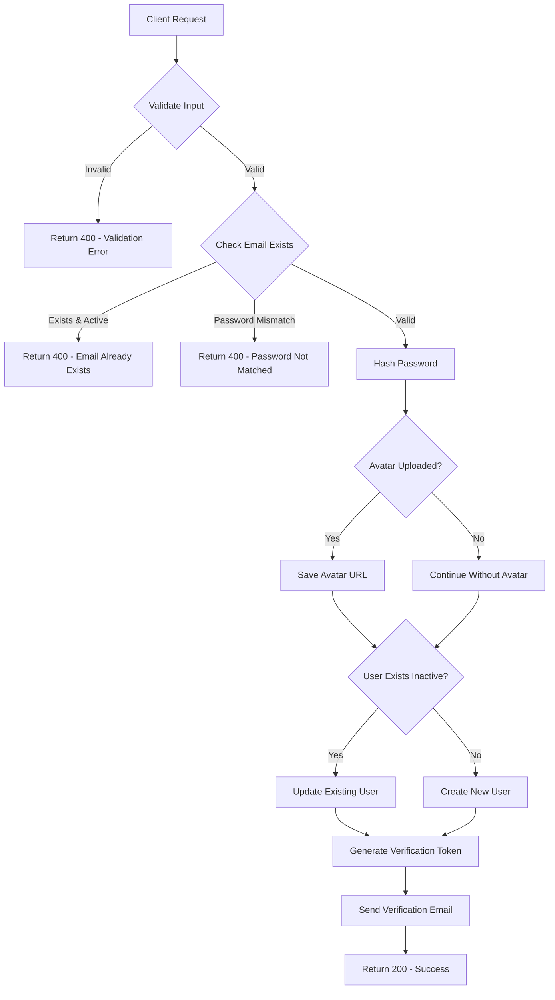
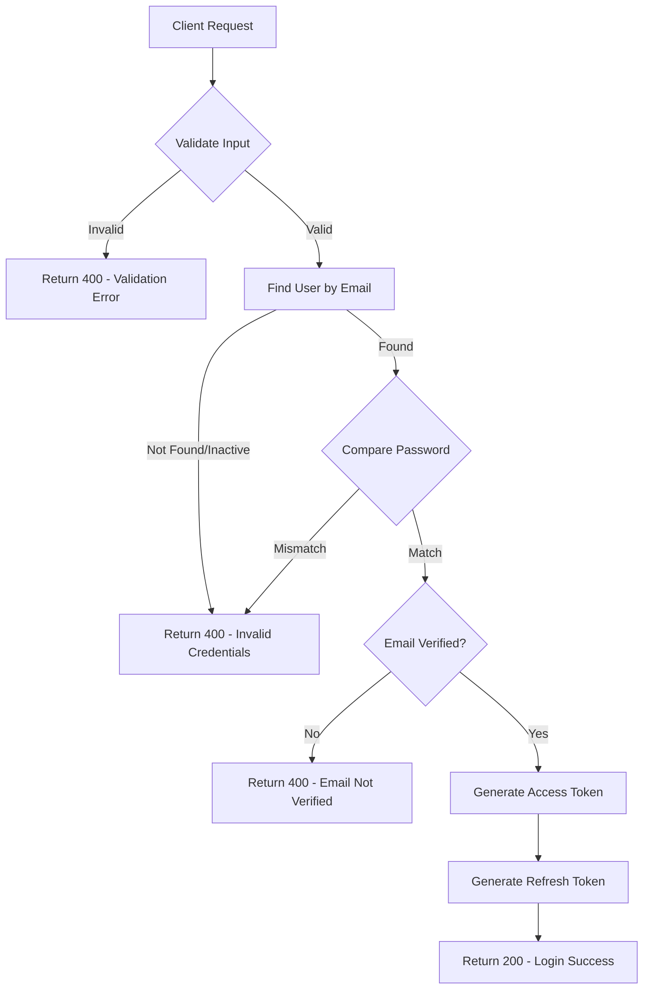
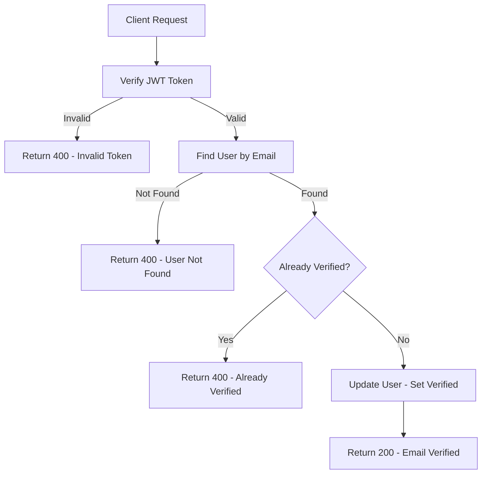
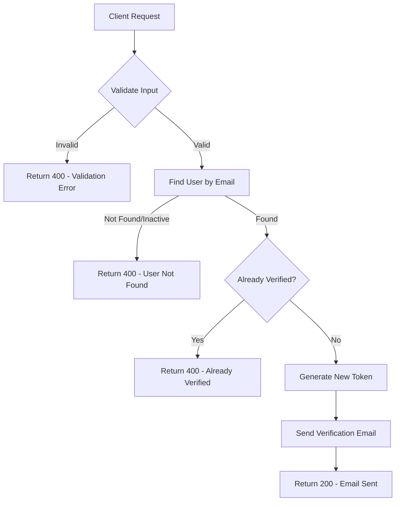
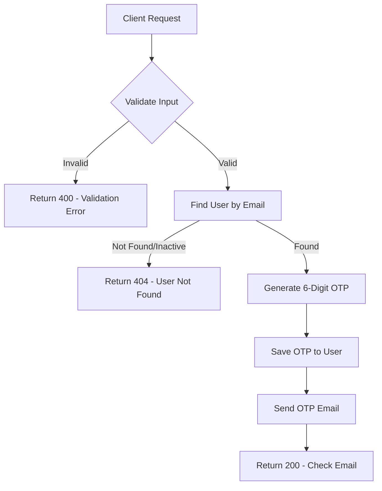
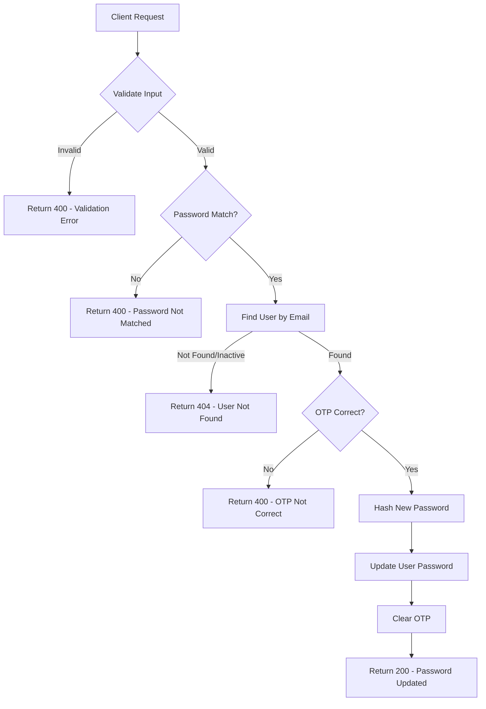
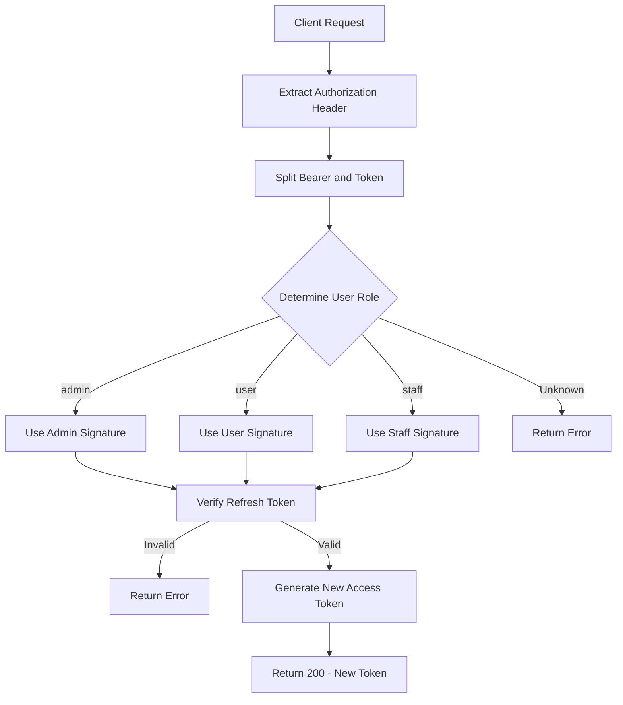

# Authentication APIs Flowcharts

## 1. POST /api/v1/auth/signup

## 2. POST /api/v1/auth/login

## 3. GET /api/v1/auth/verify-email/:token

## 4. POST /api/v1/auth/resend-verification

## 5. POST /api/v1/auth/forget-password

## 6. POST /api/v1/auth/reset-password

## 7. POST /api/v1/auth/generate-new-access-token

