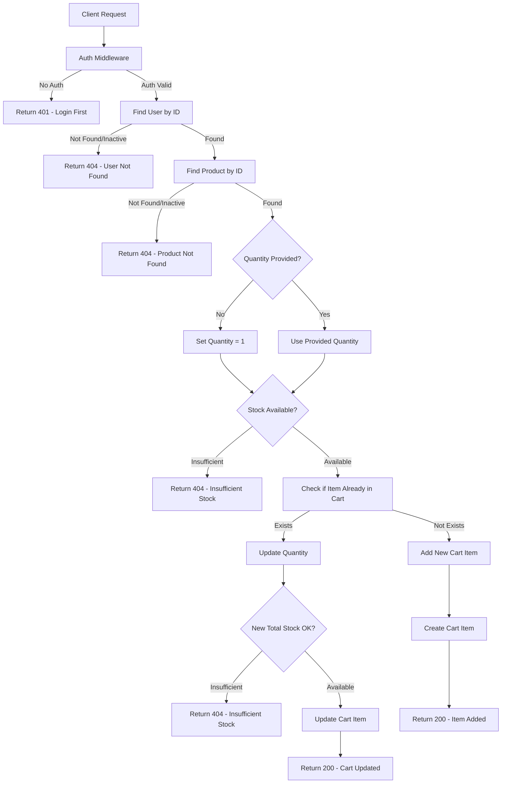
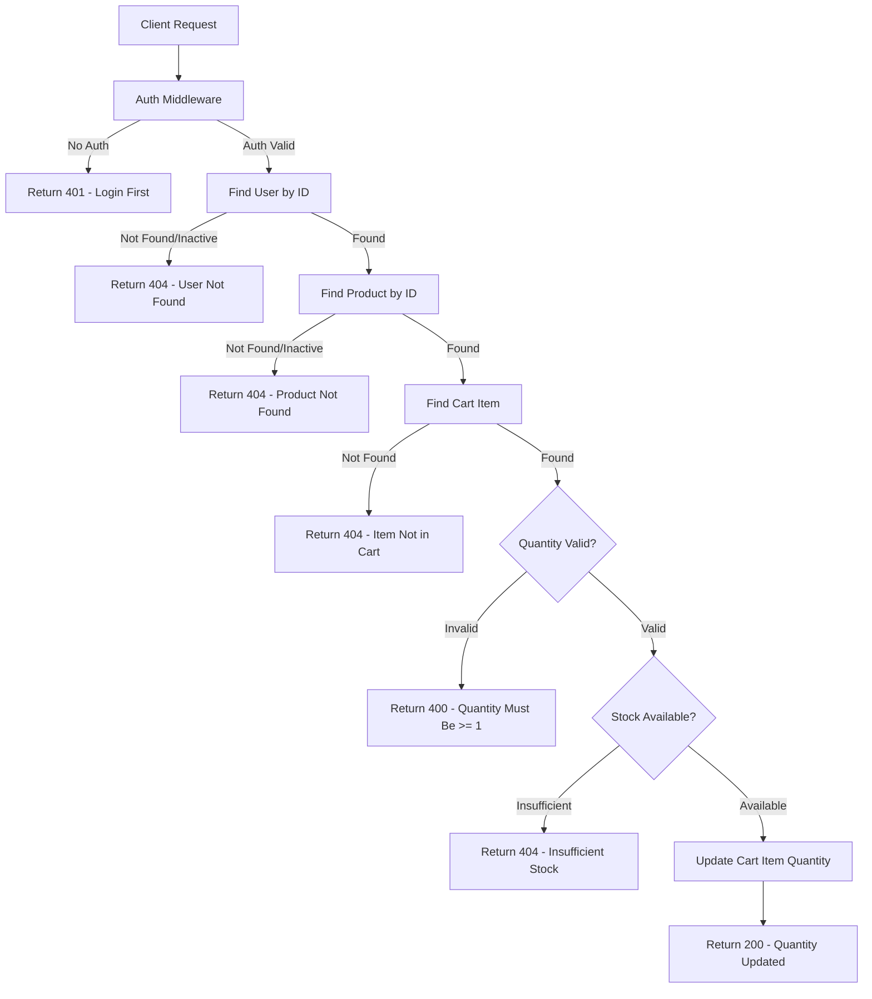
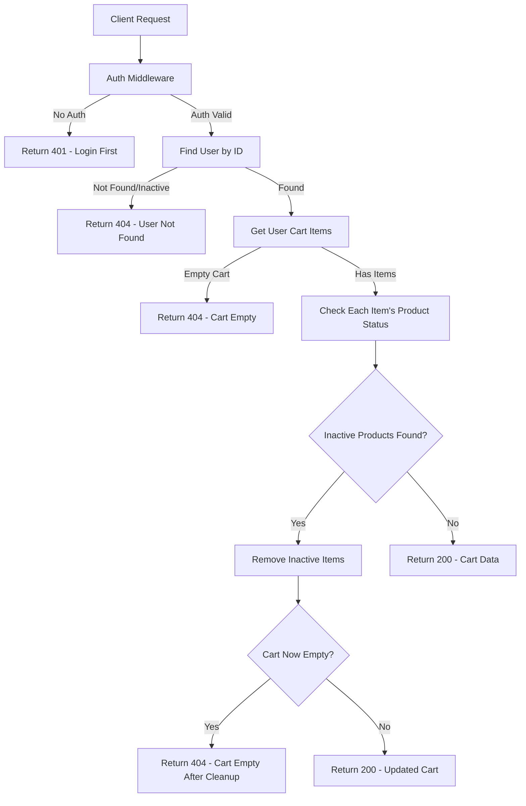
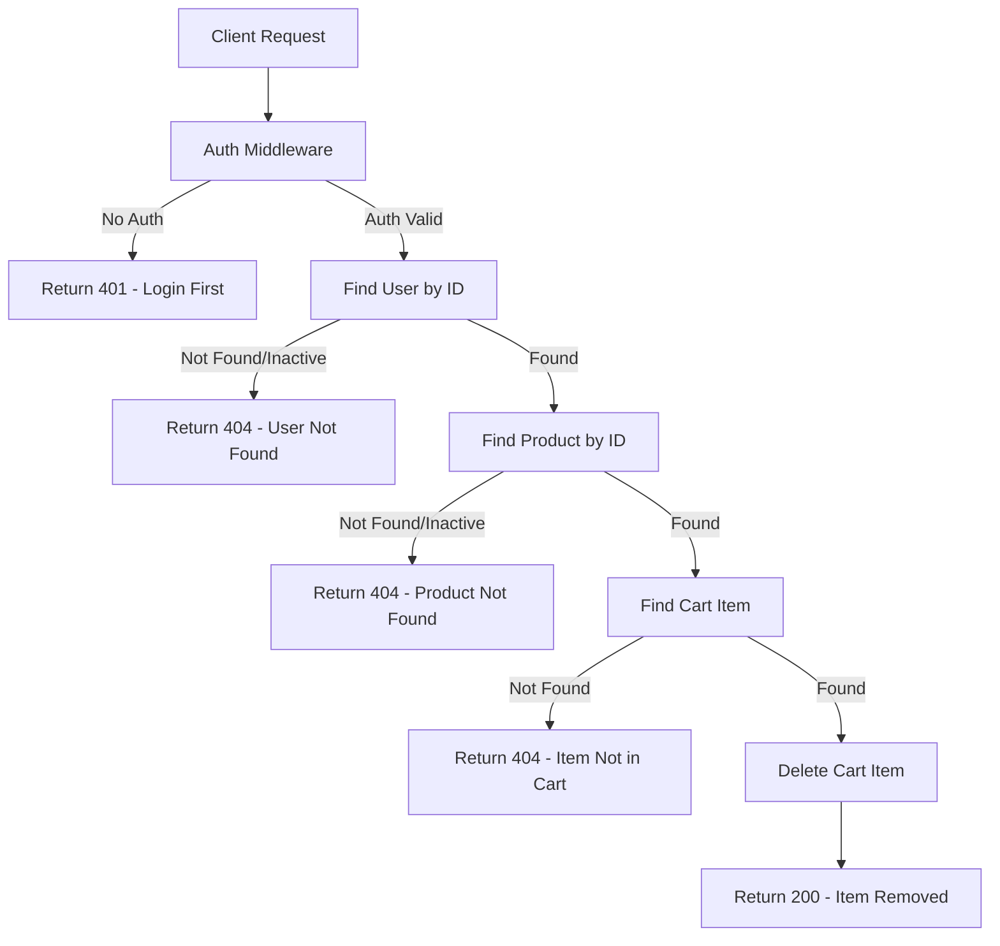
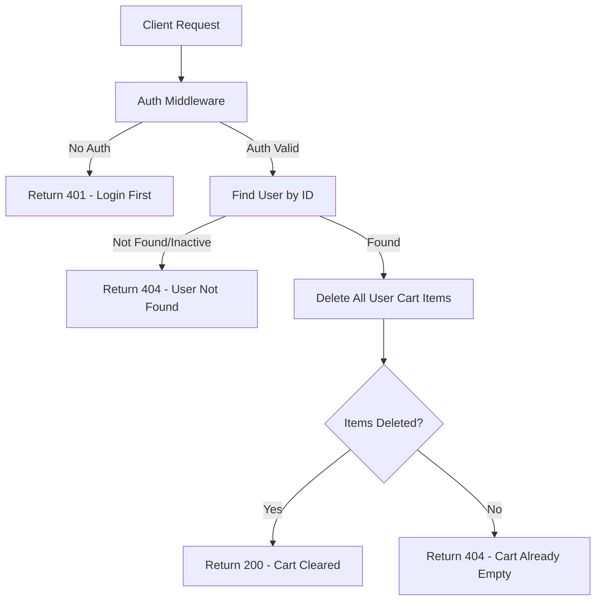

# Cart APIs Flowcharts

## 1. POST /api/v1/cart (Add Item to Cart)

## 2. PUT /api/v1/cart/:productId (Update Quantity)

## 3. GET /api/v1/cart (View Cart)

## 4. DELETE /api/v1/cart/:productId (Remove Item)

## 5. DELETE /api/v1/cart (Clear Cart)

