# Category APIs Flowcharts

## 1. POST /api/v1/categories (Admin Only)

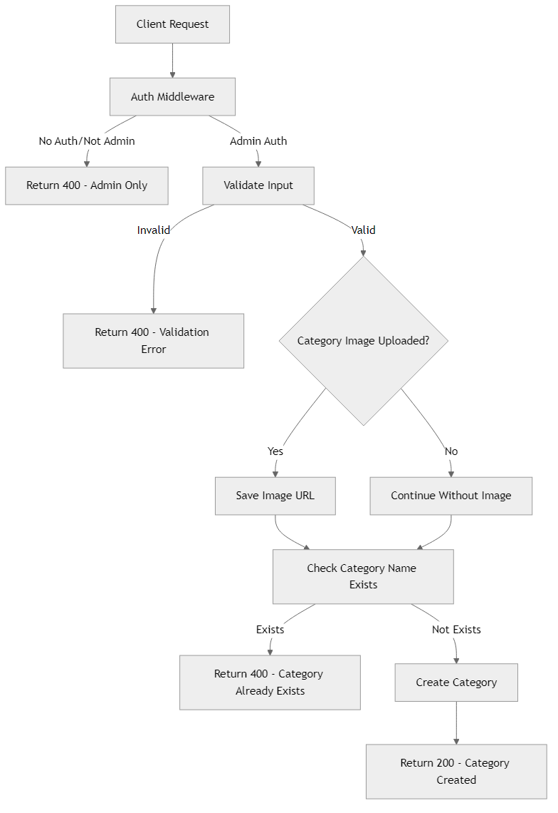

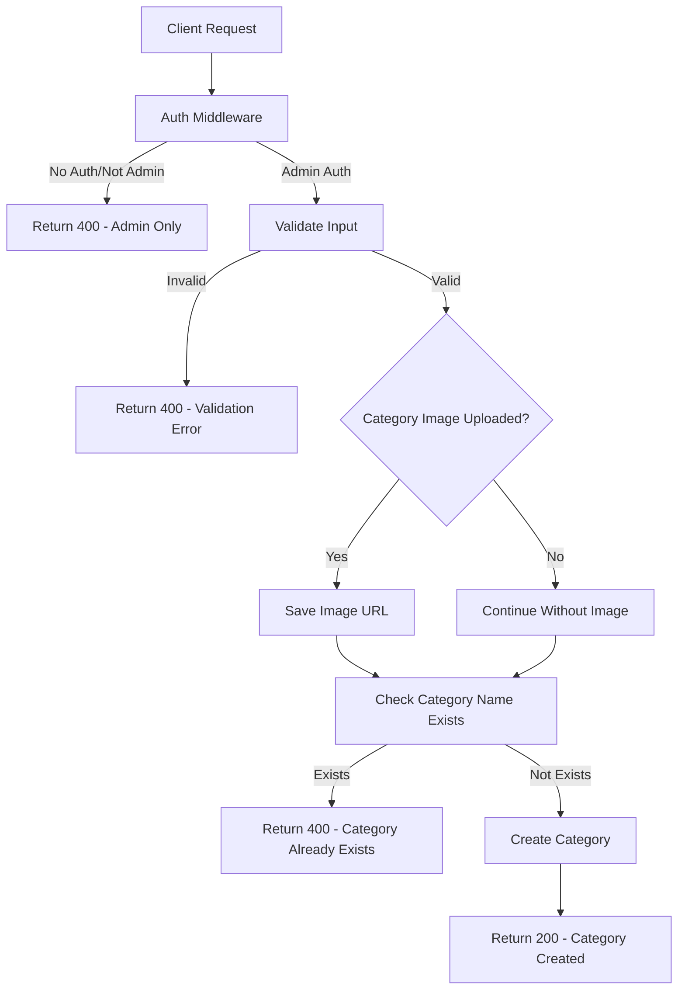

## 2. PUT /api/v1/categories/:id (Admin Only)

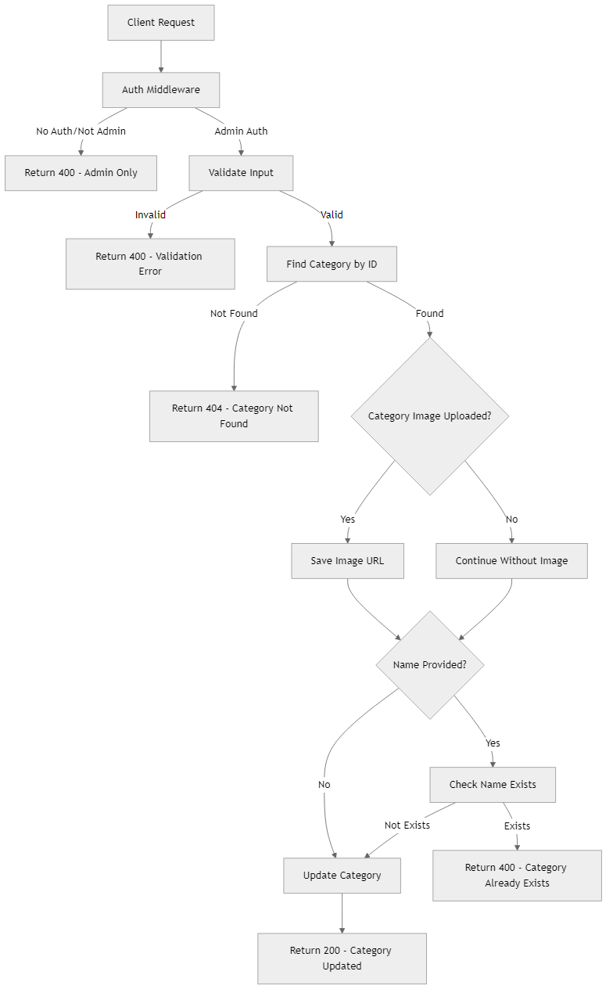

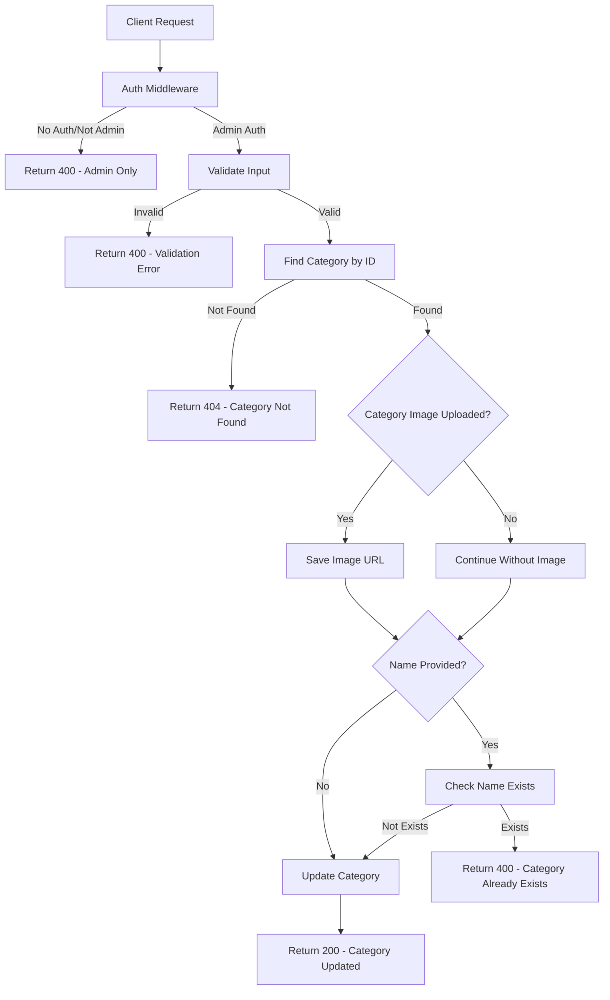

## 3. DELETE /api/v1/categories/:id (Admin Only)

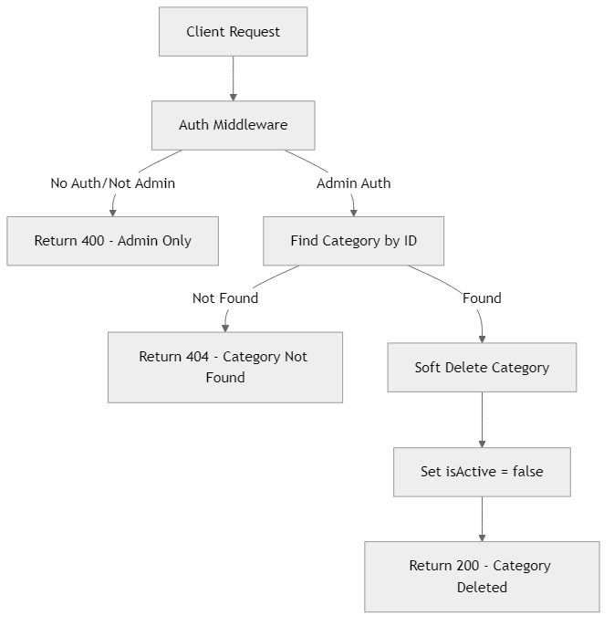

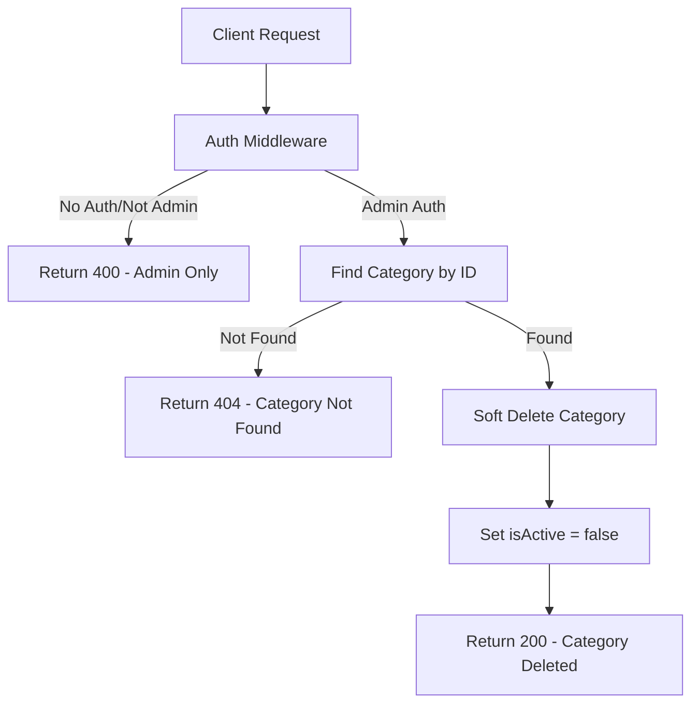

## 4. GET /api/v1/categories/admin (Admin Only)

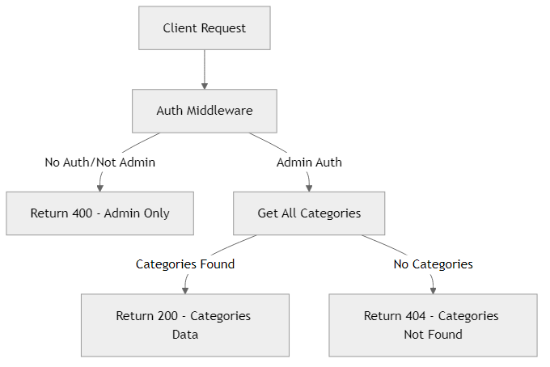

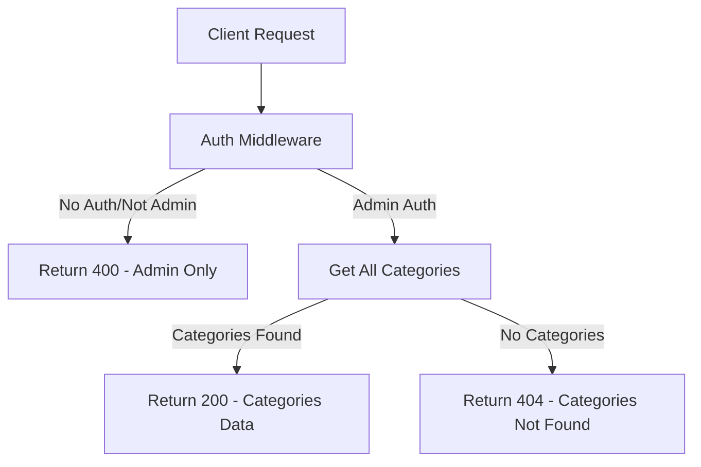

## 5. GET /api/v1/categories/:id/admin (Admin Only)

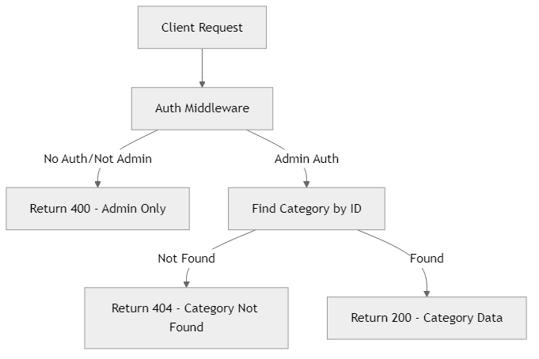

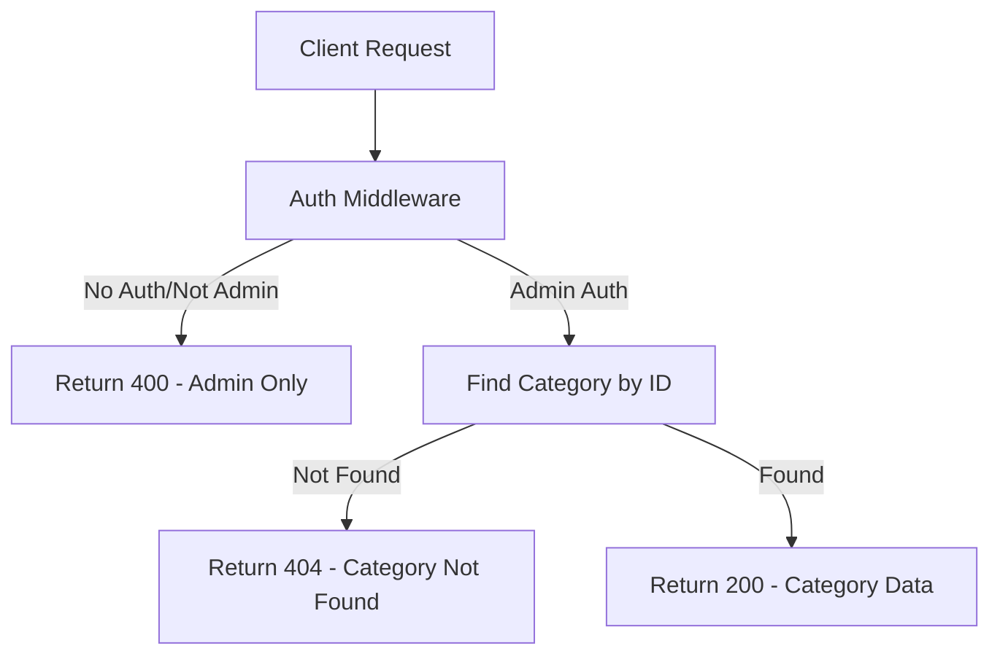

## 6. GET /api/v1/categories (Public)

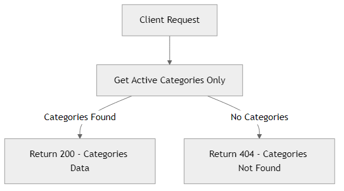

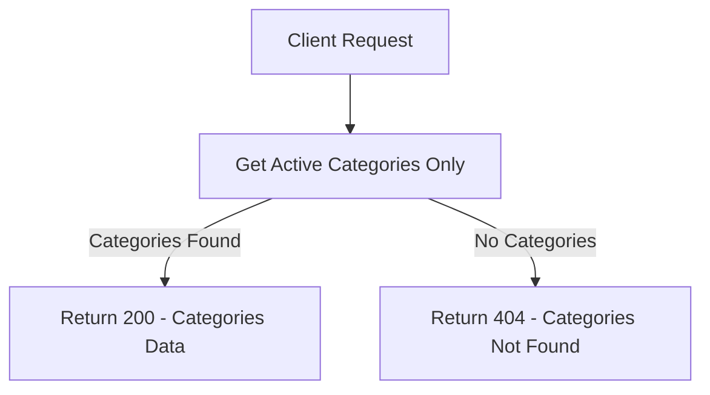

## 7. GET /api/v1/categories/:id/subcategories (Public)

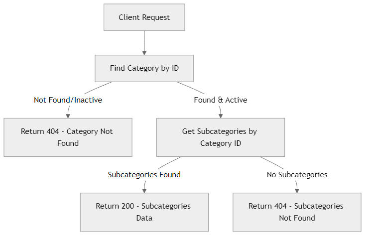

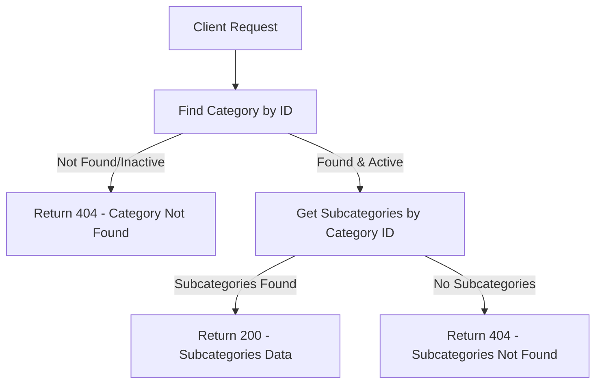
