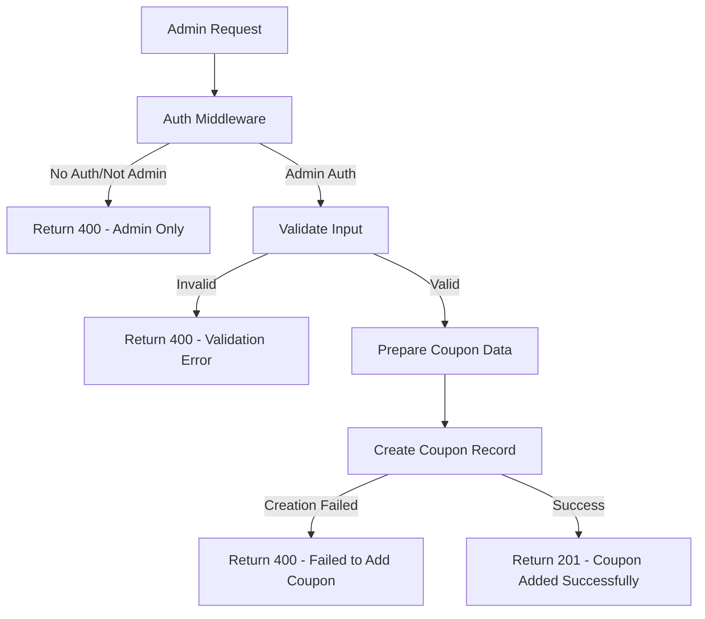
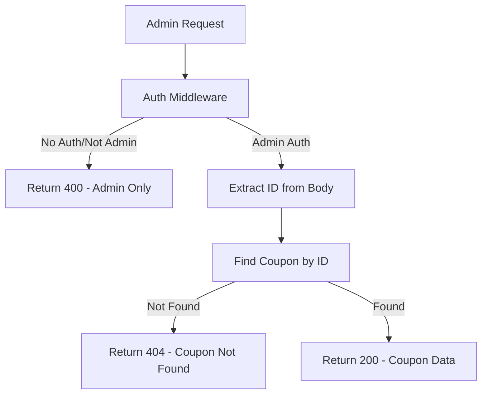
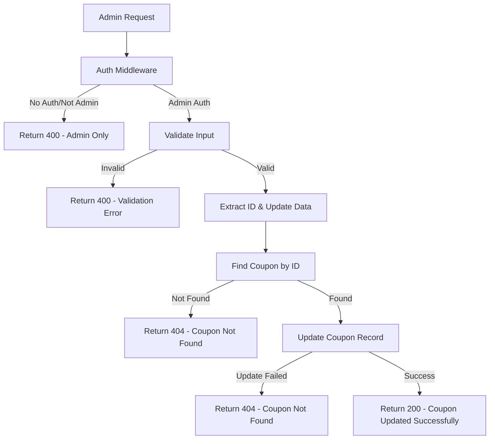
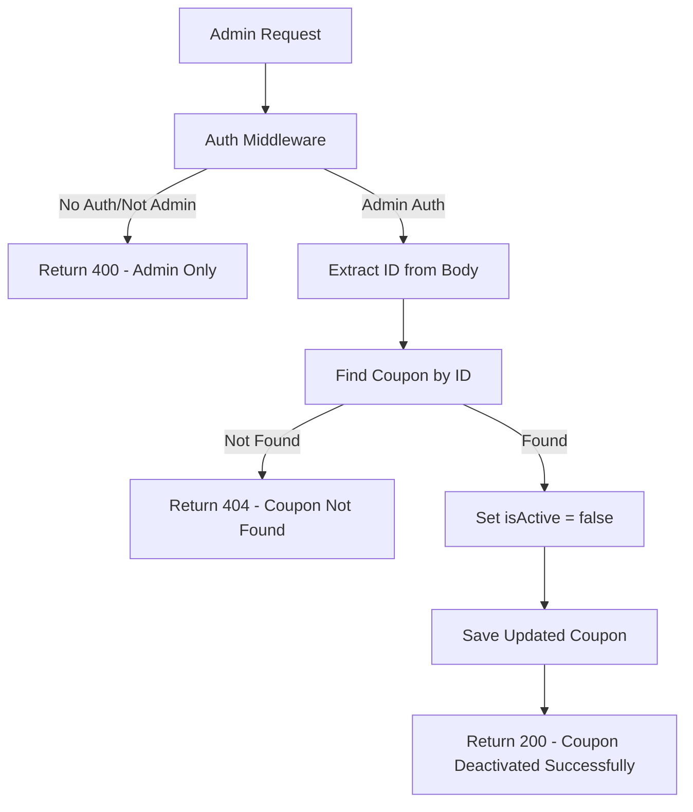
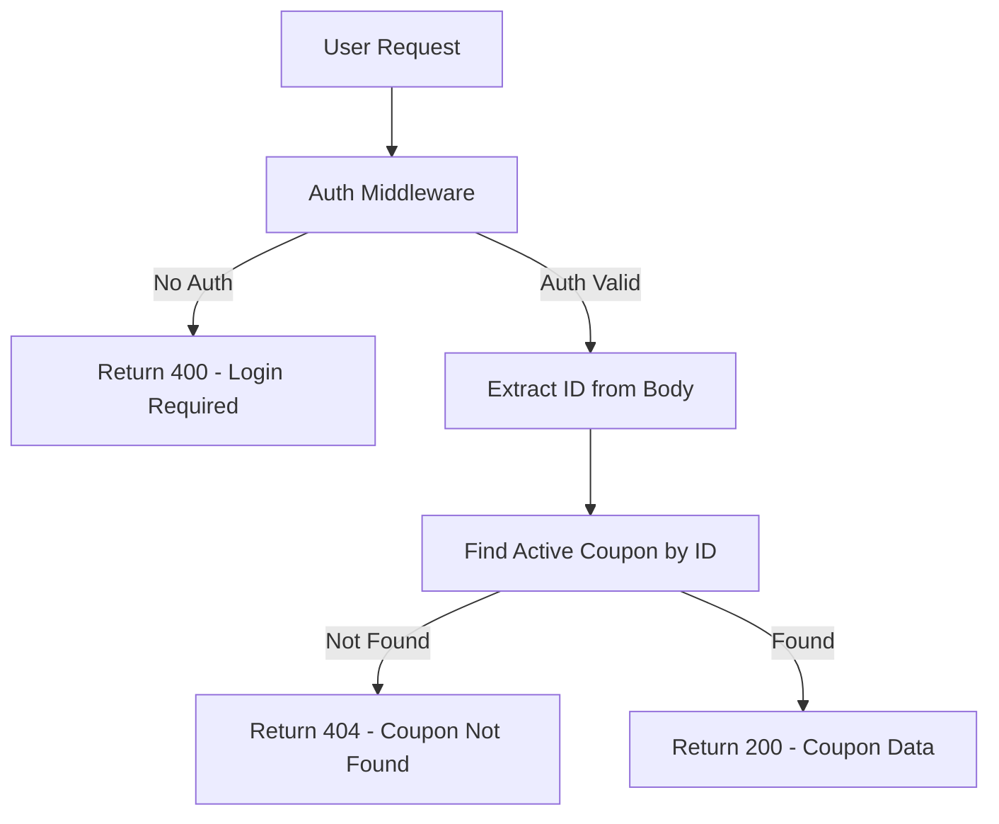
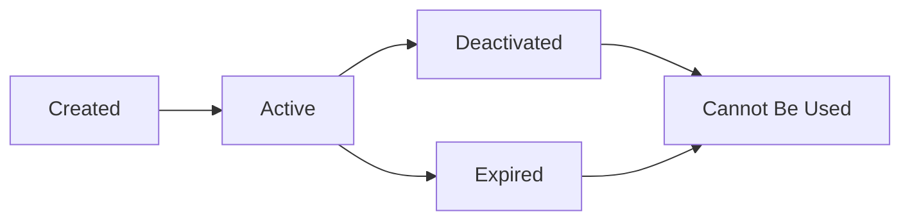
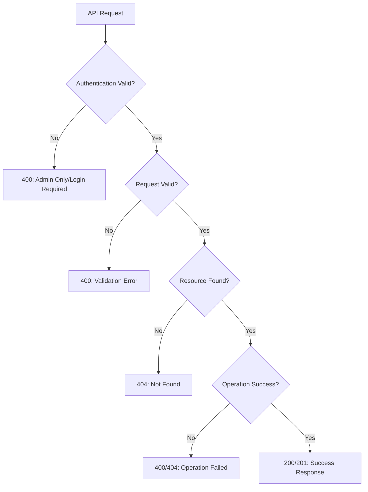
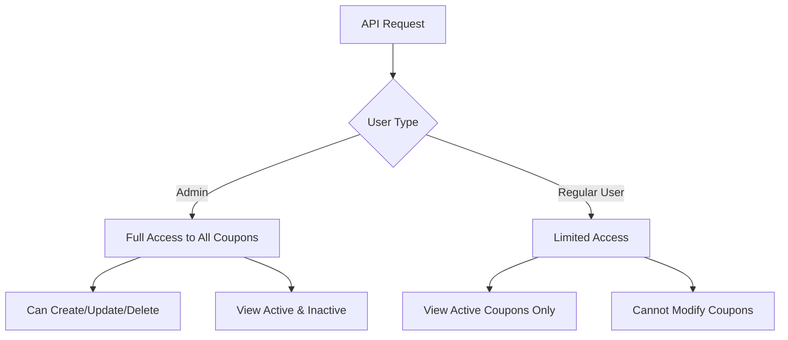
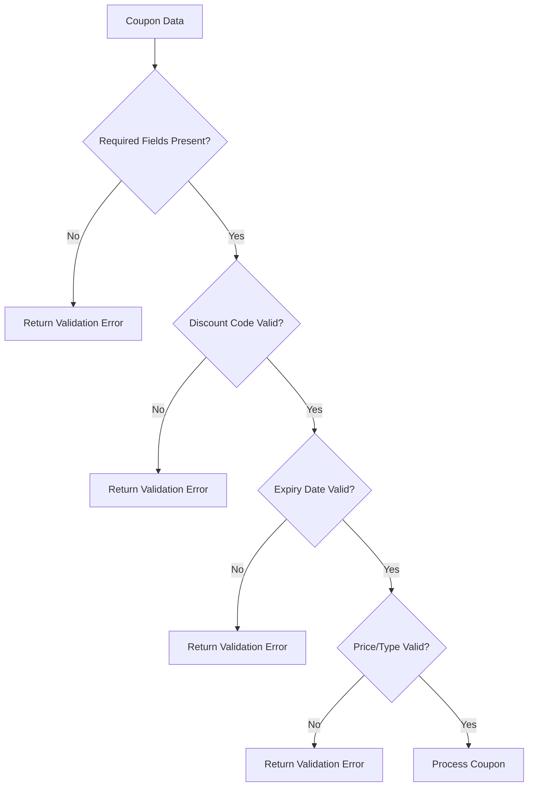

# Coupon APIs Flowcharts

## Admin Coupon APIs

### 1. POST /api/v1/coupons/admin - Add Coupon




### 2. GET /api/v1/coupons/admin - Get All Coupons (Admin)


```mermaid
flowchart TD
    A[Admin Request] --> B[Auth Middleware]
    B -->|No Auth/Not Admin| C[Return 400 - Admin Only]
    B -->|Admin Auth| D{Page & Limit Provided?}
    D -->|Yes| E[Extract Page & Limit]
    E --> F[Calculate Skip = (page-1) * limit]
    F --> G[Query with Pagination]
    G --> H[Get Total Count]
    H --> I[Calculate Total Pages]
    I --> J{Coupons Found?}
    J -->|No| K[Return 404 - No Coupons Found]
    J -->|Yes| L[Return 200 with Pagination Data]
    D -->|No| M[Query All Coupons]
    M --> N{Coupons Found?}
    N -->|No| O[Return 404 - No Coupons Found]
    N -->|Yes| P[Return 200 - All Coupons Data]
```

### 3. GET /api/v1/coupons/admin/:id - Get One Coupon (Admin)




### 4. PUT /api/v1/coupons/admin - Update Coupon




### 5. DELETE /api/v1/coupons/admin - Delete/Deactivate Coupon




## User Coupon APIs

### 6. GET /api/v1/coupons - Get All Coupons (User)


```mermaid
flowchart TD
    A[User Request] --> B[Auth Middleware]
    B -->|No Auth| C[Return 400 - Login Required]
    B -->|Auth Valid| D{Page & Limit Provided?}
    D -->|Yes| E[Extract Page & Limit]
    E --> F[Calculate Skip = (page-1) * limit]
    F --> G[Query Active Coupons with Pagination]
    G --> H[Get Total Count]
    H --> I[Calculate Total Pages]
    I --> J{Active Coupons Found?}
    J -->|No| K[Return 404 - No Coupons Found]
    J -->|Yes| L[Return 200 with Pagination Data]
    D -->|No| M[Query All Active Coupons]
    M --> N{Active Coupons Found?}
    N -->|No| O[Return 404 - No Coupons Found]
    N -->|Yes| P[Return 200 - All Active Coupons Data]
```

### 7. GET /api/v1/coupons/:id - Get One Coupon (User)




## Coupon Status Flow



## Pagination Logic

```mermaid
flowchart TD
    A[Request with Page & Limit] --> B[Calculate Skip]
    B --> C[Skip = (Page - 1) * Limit]
    C --> D[Apply Skip & Limit to Query]
    D --> E[Get Total Count]
    E --> F[Calculate Total Pages = ceil(Total/Limit)]
    F --> G[Return Data + Pagination Info]
    G --> H{Has Next Page?}
    G --> I[hasNextPage = true]
    H -->|Yes| I
    H -->|No| J[hasNextPage = false]
```

## Error Handling Patterns



## Data Access Patterns



## Coupon Validation Rules


