# Orders APIs Flowcharts

## User APIs

### POST /checkout - Create Order

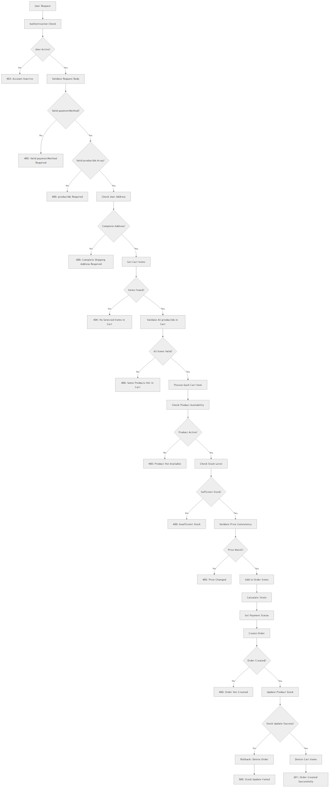

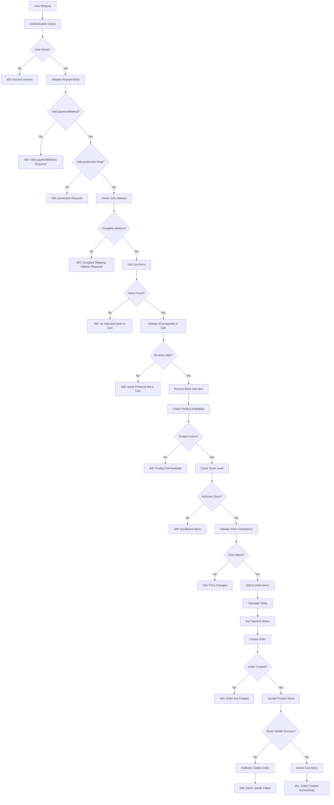

### GET / - Get User Orders

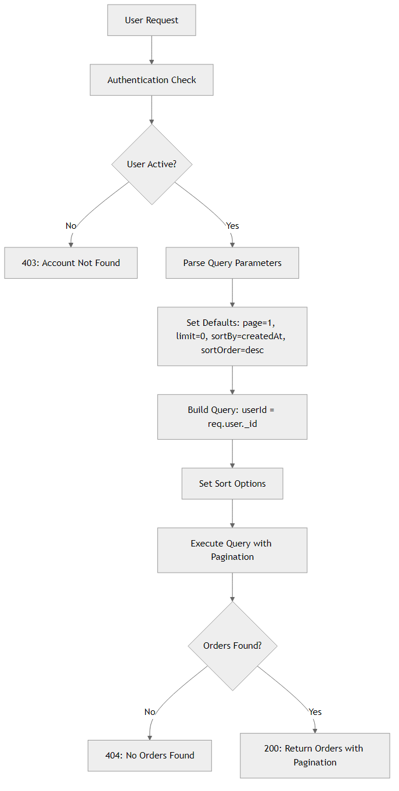

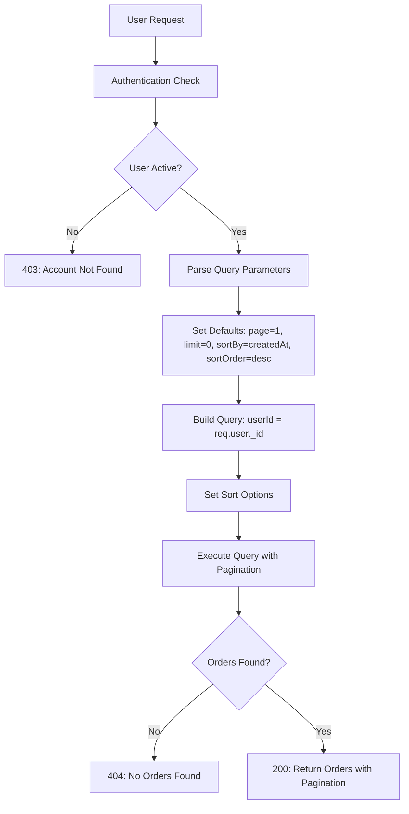

### GET /:id - Get Single Order

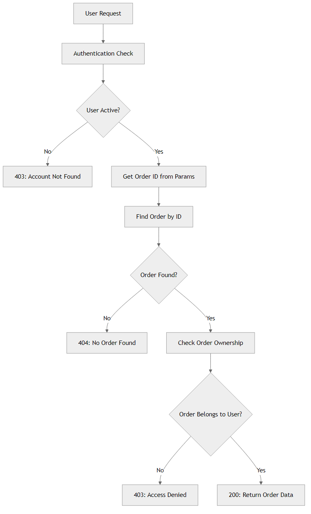

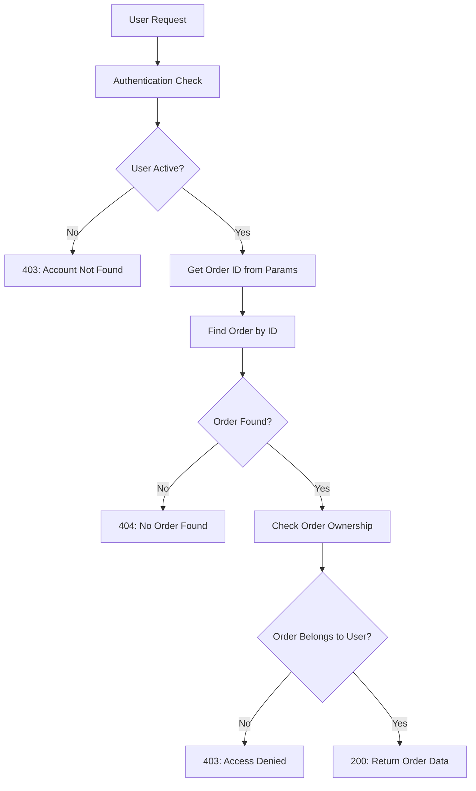

## Admin APIs

### GET /admin - Get All Orders

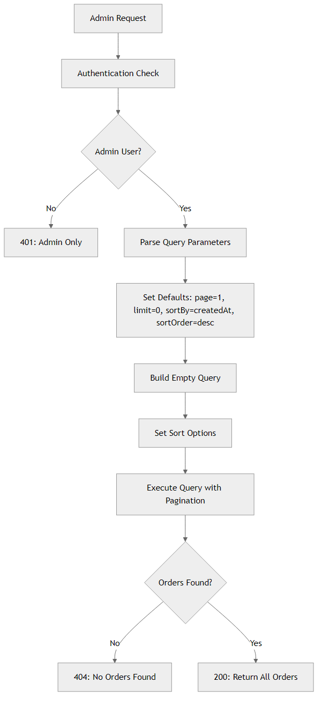

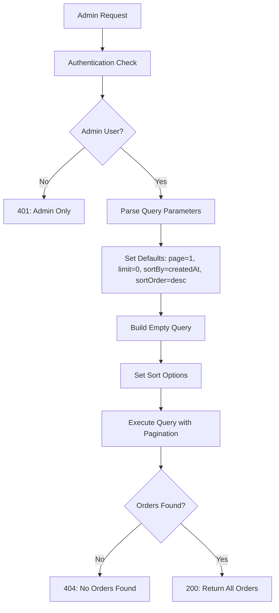

### PATCH /admin/:id/status - Update Order Status

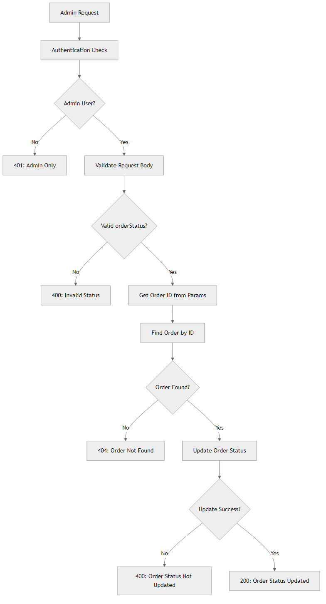

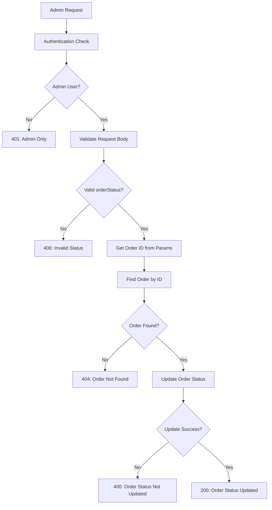

## Order Status Flow

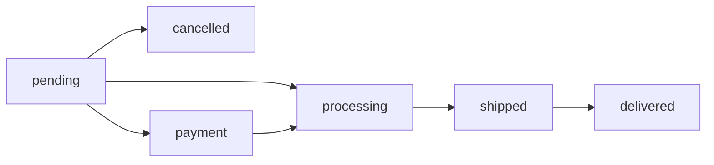

## Payment Methods

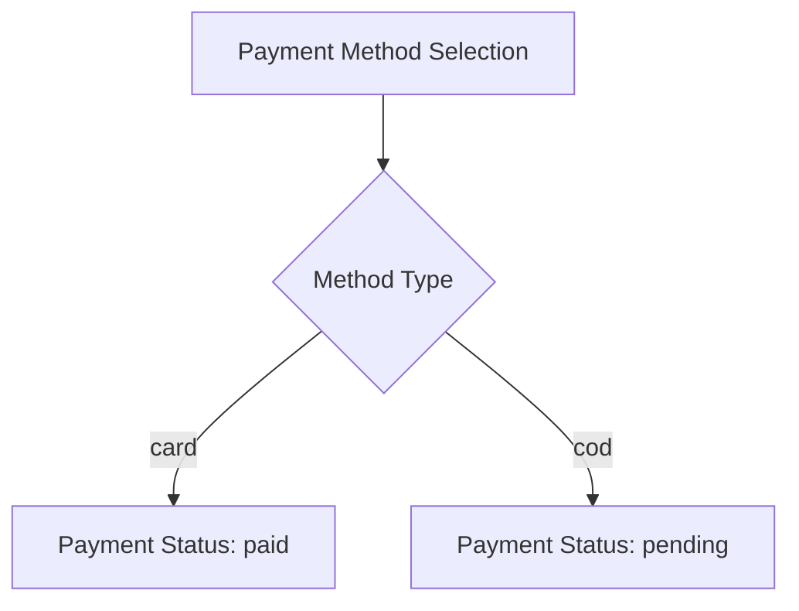

## Error Handling Patterns

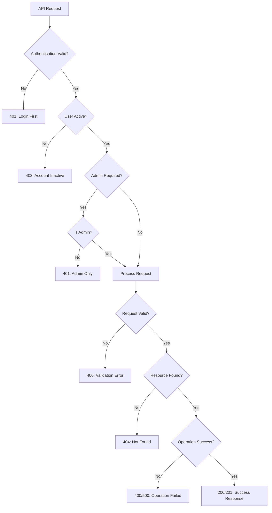

## Security Checks

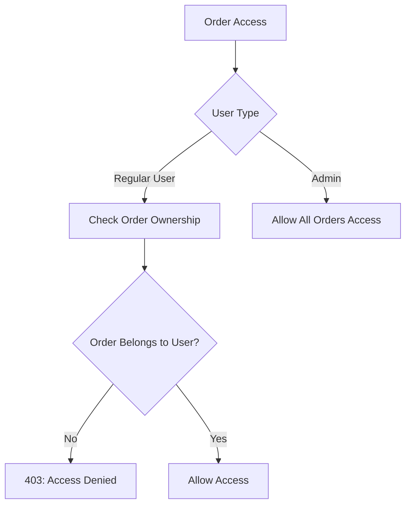
