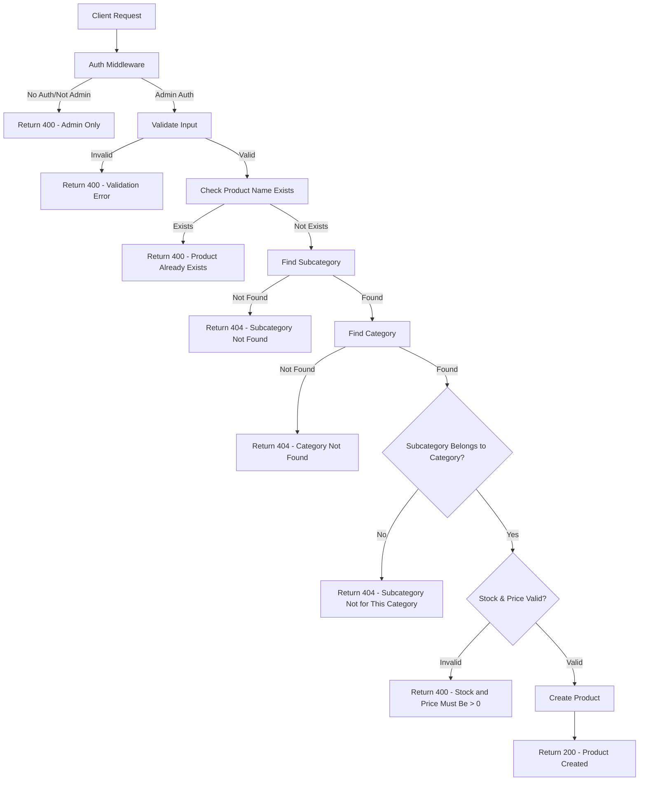
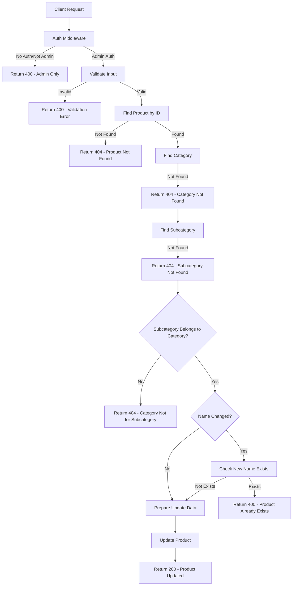
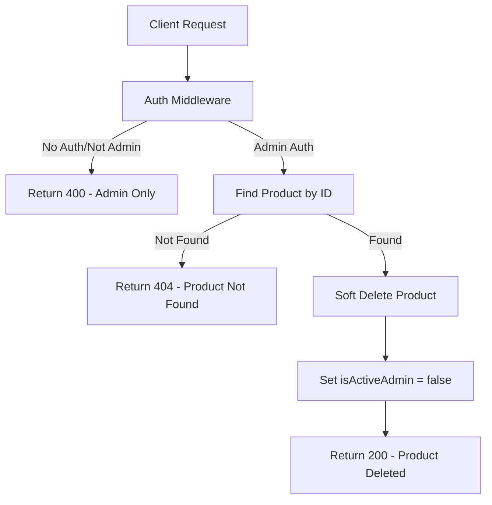
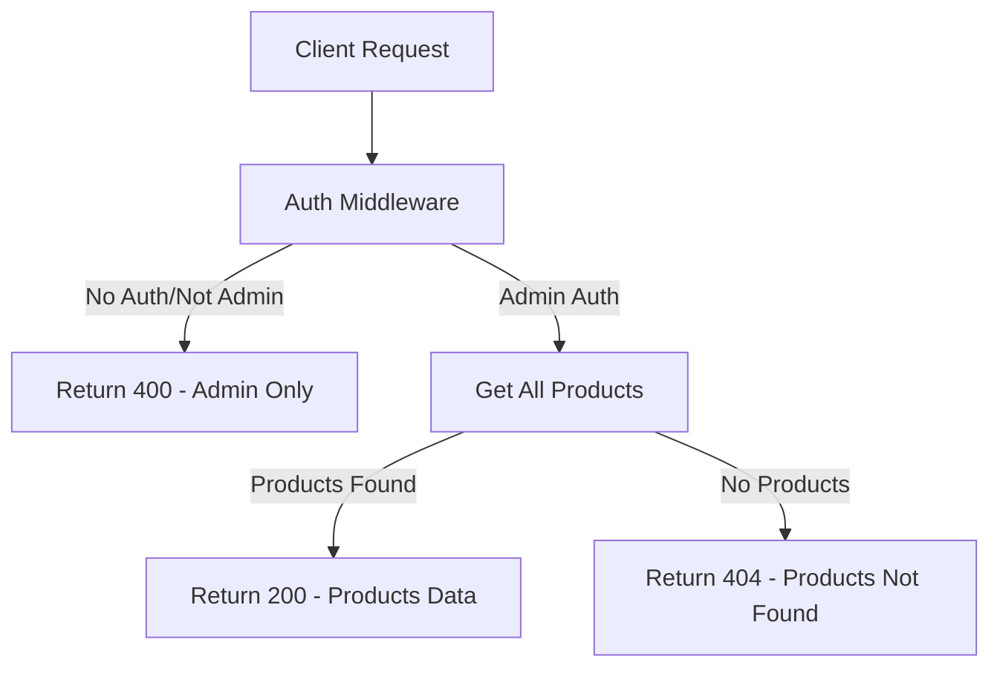
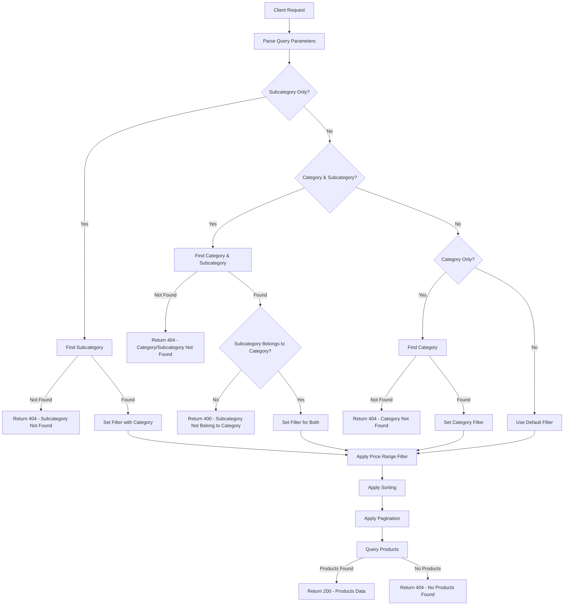
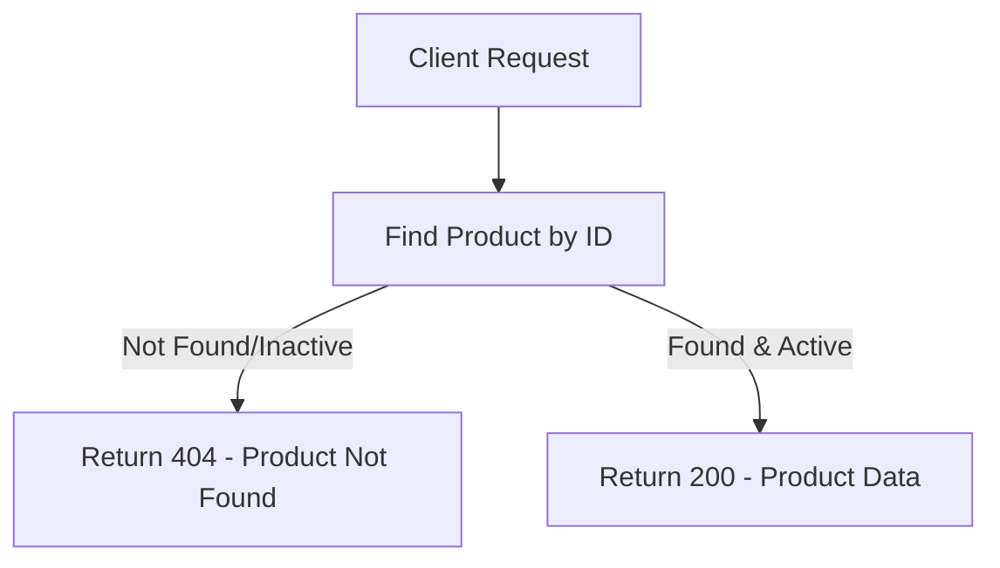

# Product APIs Flowcharts

## 1. POST /api/v1/products (Admin Only)

## 2. PUT /api/v1/products/:id (Admin Only)

## 3. DELETE /api/v1/products/:id (Admin Only)

## 4. GET /api/v1/products/admin (Admin Only)

## 5. GET /api/v1/products (Public)

## 6. GET /api/v1/products/:id (Public)

