# Staff APIs Flowcharts

## Staff Management APIs (Admin Only)

### 1. GET /api/v1/staff/admin - Get All Staff

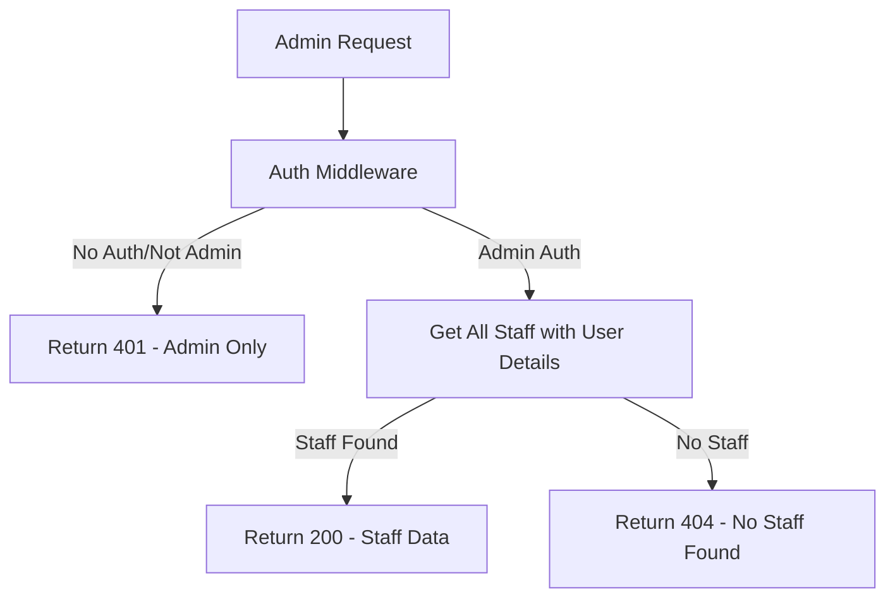
```mermaid
flowchart TD
    A[Admin Request] --> B[Auth Middleware]
    B -->|No Auth/Not Admin| C[Return 401 - Admin Only]
    B -->|Admin Auth| D[Get All Staff with User Details]
    D -->|Staff Found| E[Return 200 - Staff Data]
    D -->|No Staff| F[Return 404 - No Staff Found]
```

### 2. POST /api/v1/staff/admin - Add Staff

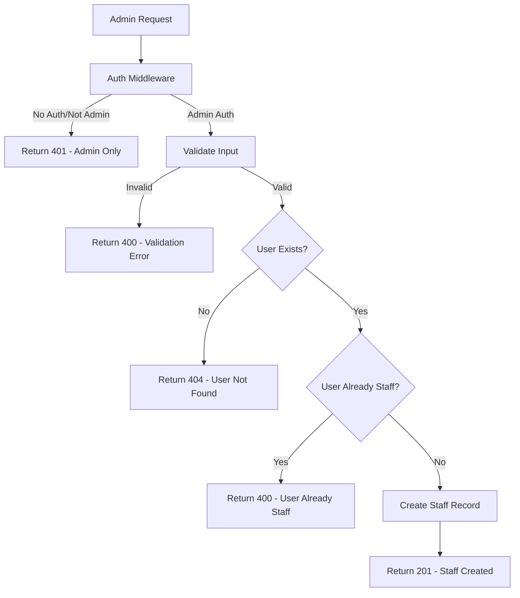
```mermaid
flowchart TD
    A[Admin Request] --> B[Auth Middleware]
    B -->|No Auth/Not Admin| C[Return 401 - Admin Only]
    B -->|Admin Auth| D[Validate Input]
    D -->|Invalid| E[Return 400 - Validation Error]
    D -->|Valid| F{User Exists?}
    F -->|No| G[Return 404 - User Not Found]
    F -->|Yes| H{User Already Staff?}
    H -->|Yes| I[Return 400 - User Already Staff]
    H -->|No| J[Create Staff Record]
    J --> K[Return 201 - Staff Created]
```

### 3. GET /api/v1/staff/admin/:id - Get Staff Details

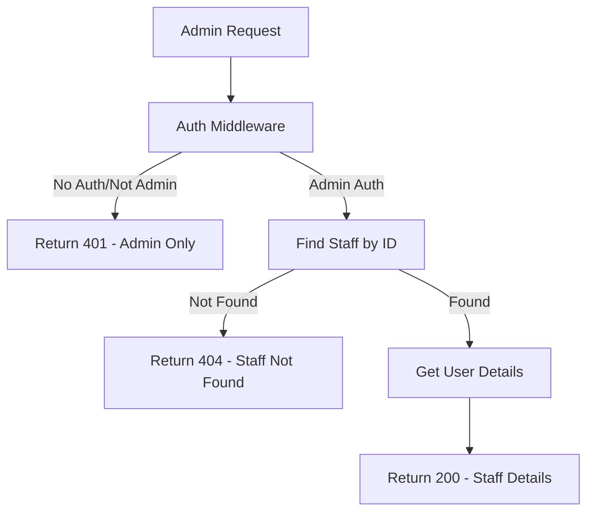
```mermaid
flowchart TD
    A[Admin Request] --> B[Auth Middleware]
    B -->|No Auth/Not Admin| C[Return 401 - Admin Only]
    B -->|Admin Auth| D[Find Staff by ID]
    D -->|Not Found| E[Return 404 - Staff Not Found]
    D -->|Found| F[Get User Details]
    F --> G[Return 200 - Staff Details]
```

### 4. PUT /api/v1/staff/admin/:id - Update Staff

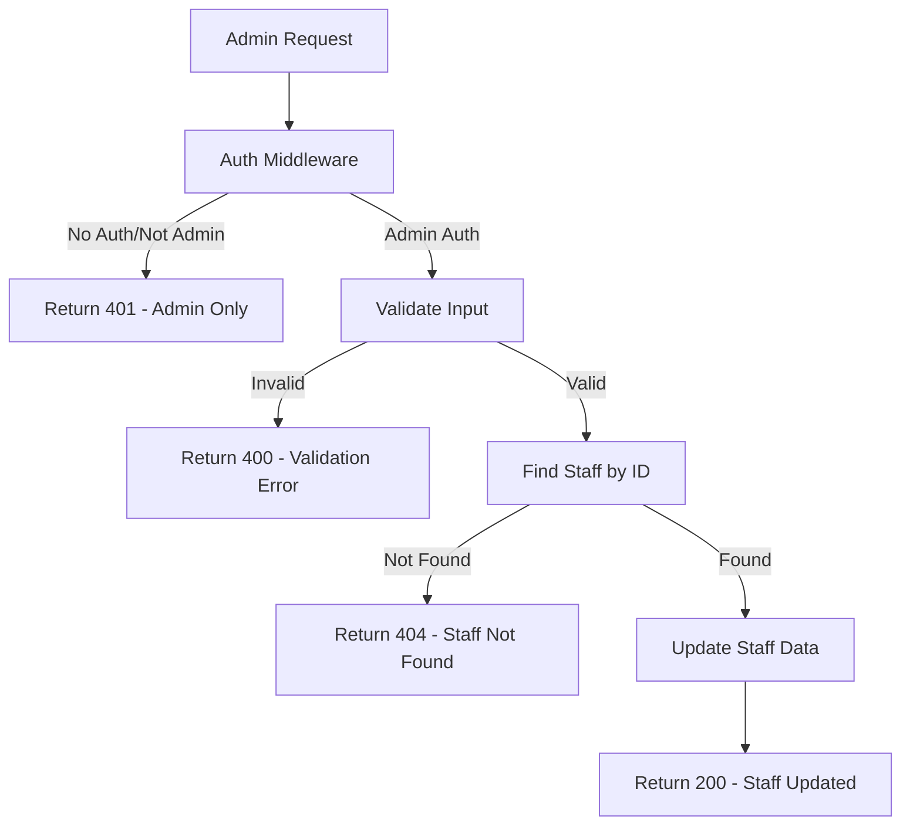
```mermaid
flowchart TD
    A[Admin Request] --> B[Auth Middleware]
    B -->|No Auth/Not Admin| C[Return 401 - Admin Only]
    B -->|Admin Auth| D[Validate Input]
    D -->|Invalid| E[Return 400 - Validation Error]
    D -->|Valid| F[Find Staff by ID]
    F -->|Not Found| G[Return 404 - Staff Not Found]
    F -->|Found| H[Update Staff Data]
    H --> I[Return 200 - Staff Updated]
```

### 5. DELETE /api/v1/staff/admin/:id - Soft Delete Staff

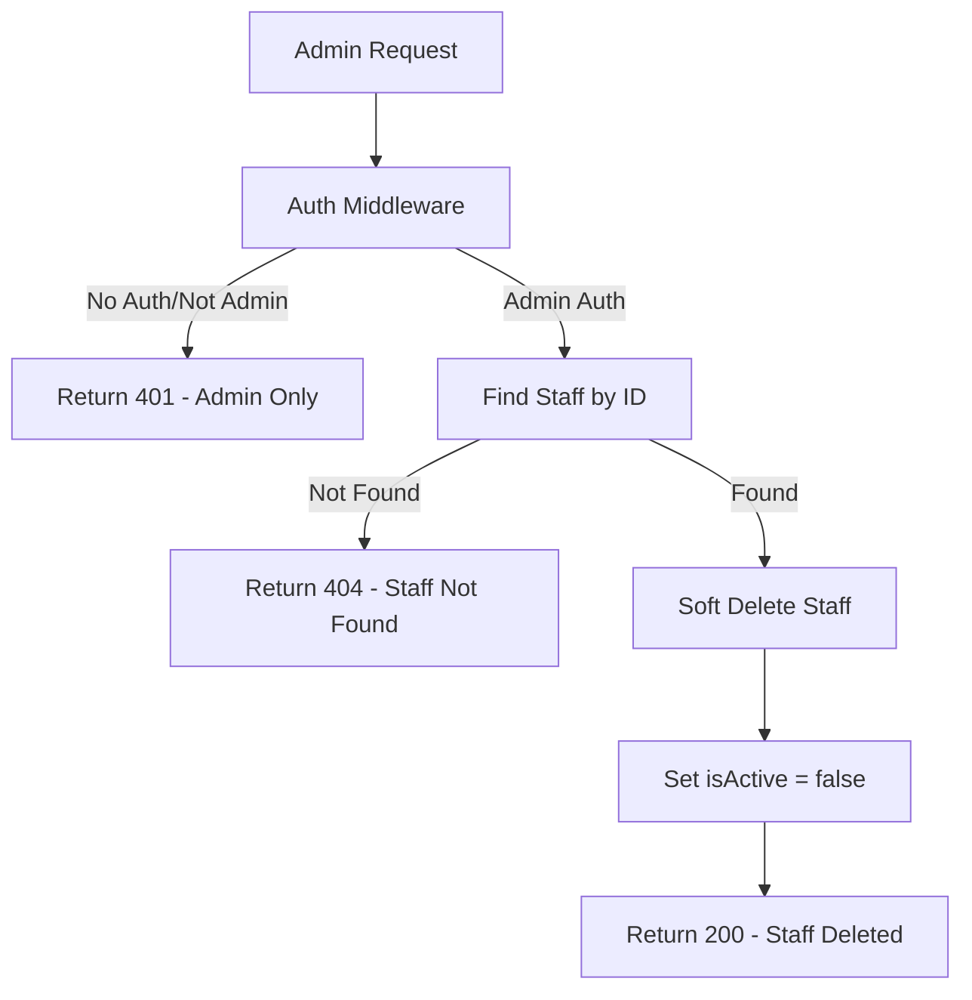
```mermaid
flowchart TD
    A[Admin Request] --> B[Auth Middleware]
    B -->|No Auth/Not Admin| C[Return 401 - Admin Only]
    B -->|Admin Auth| D[Find Staff by ID]
    D -->|Not Found| E[Return 404 - Staff Not Found]
    D -->|Found| F[Soft Delete Staff]
    F --> G[Set isActive = false]
    G --> H[Return 200 - Staff Deleted]
```

## Staff Attendance APIs

### 6. POST /api/v1/staff/check-in - Staff Check In

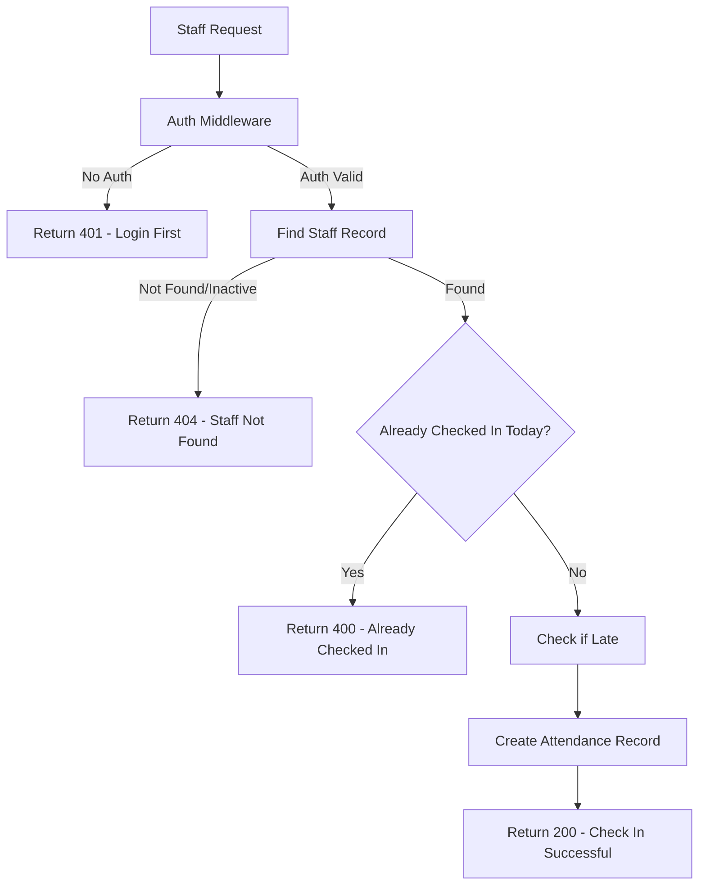
```mermaid
flowchart TD
    A[Staff Request] --> B[Auth Middleware]
    B -->|No Auth| C[Return 401 - Login First]
    B -->|Auth Valid| D[Find Staff Record]
    D -->|Not Found/Inactive| E[Return 404 - Staff Not Found]
    D -->|Found| F{Already Checked In Today?}
    F -->|Yes| G[Return 400 - Already Checked In]
    F -->|No| H[Check if Late]
    H --> I[Create Attendance Record]
    I --> J[Return 200 - Check In Successful]
```

### 7. POST /api/v1/staff/check-out - Staff Check Out

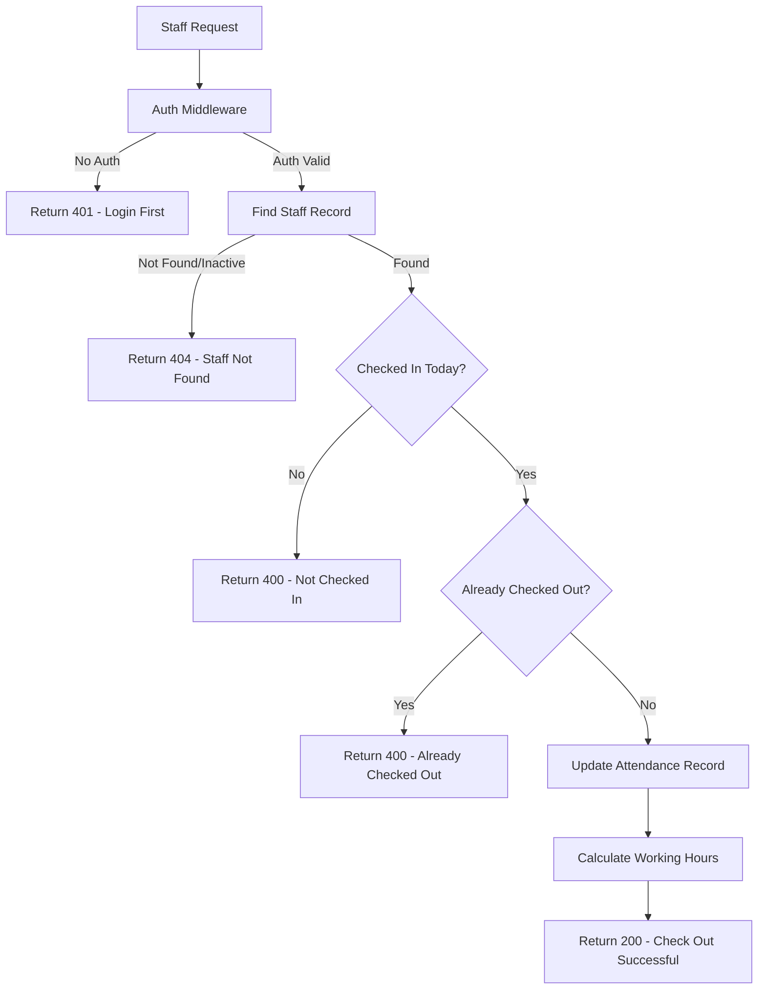
```mermaid
flowchart TD
    A[Staff Request] --> B[Auth Middleware]
    B -->|No Auth| C[Return 401 - Login First]
    B -->|Auth Valid| D[Find Staff Record]
    D -->|Not Found/Inactive| E[Return 404 - Staff Not Found]
    D -->|Found| F{Checked In Today?}
    F -->|No| G[Return 400 - Not Checked In]
    F -->|Yes| H{Already Checked Out?}
    H -->|Yes| I[Return 400 - Already Checked Out]
    H -->|No| J[Update Attendance Record]
    J --> K[Calculate Working Hours]
    K --> L[Return 200 - Check Out Successful]
```

## Staff Deduction APIs (Admin Only)

### 8. POST /api/v1/staff/admin/:id/deductions - Add Deduction

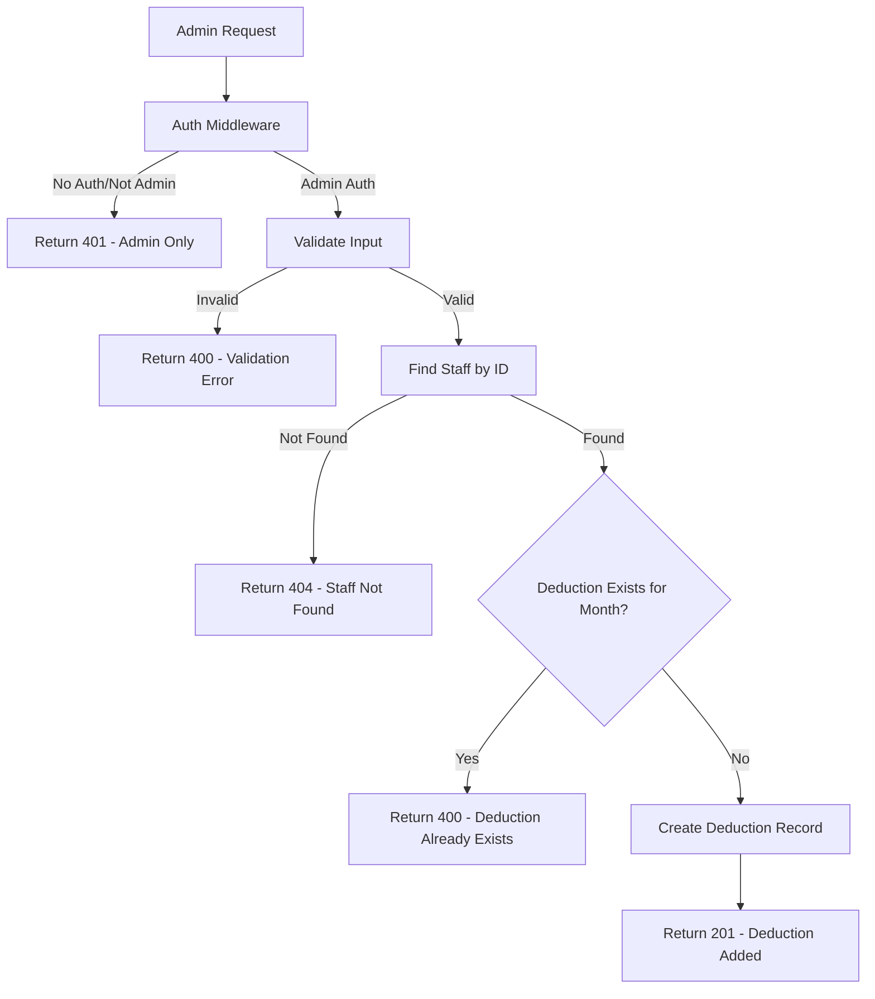
```mermaid
flowchart TD
    A[Admin Request] --> B[Auth Middleware]
    B -->|No Auth/Not Admin| C[Return 401 - Admin Only]
    B -->|Admin Auth| D[Validate Input]
    D -->|Invalid| E[Return 400 - Validation Error]
    D -->|Valid| F[Find Staff by ID]
    F -->|Not Found| G[Return 404 - Staff Not Found]
    F -->|Found| H{Deduction Exists for Month?}
    H -->|Yes| I[Return 400 - Deduction Already Exists]
    H -->|No| J[Create Deduction Record]
    J --> K[Return 201 - Deduction Added]
```

### 9. GET /api/v1/staff/admin/:id/deductions - Get Staff Deductions

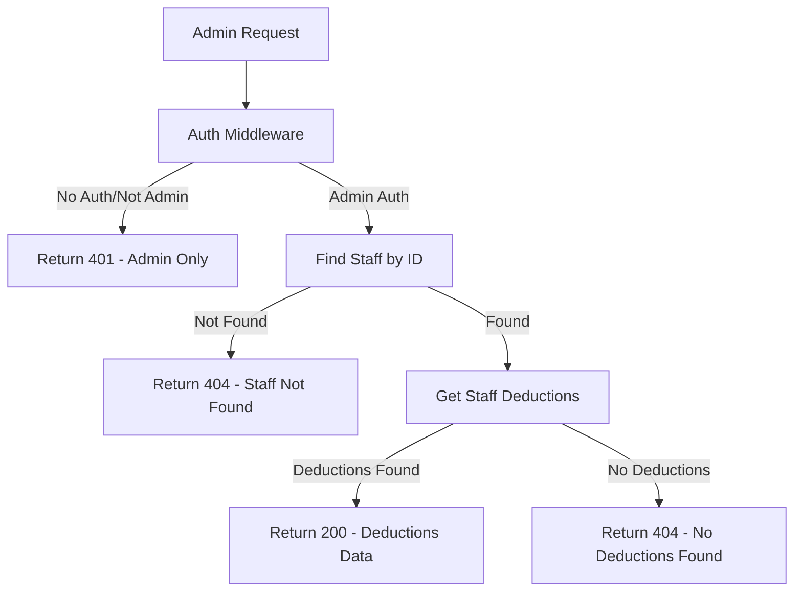
```mermaid
flowchart TD
    A[Admin Request] --> B[Auth Middleware]
    B -->|No Auth/Not Admin| C[Return 401 - Admin Only]
    B -->|Admin Auth| D[Find Staff by ID]
    D -->|Not Found| E[Return 404 - Staff Not Found]
    D -->|Found| F[Get Staff Deductions]
    F -->|Deductions Found| G[Return 200 - Deductions Data]
    F -->|No Deductions| H[Return 404 - No Deductions Found]
```

### 10. PUT /api/v1/staff/admin/:id/deductions/:deductionId - Update Deduction

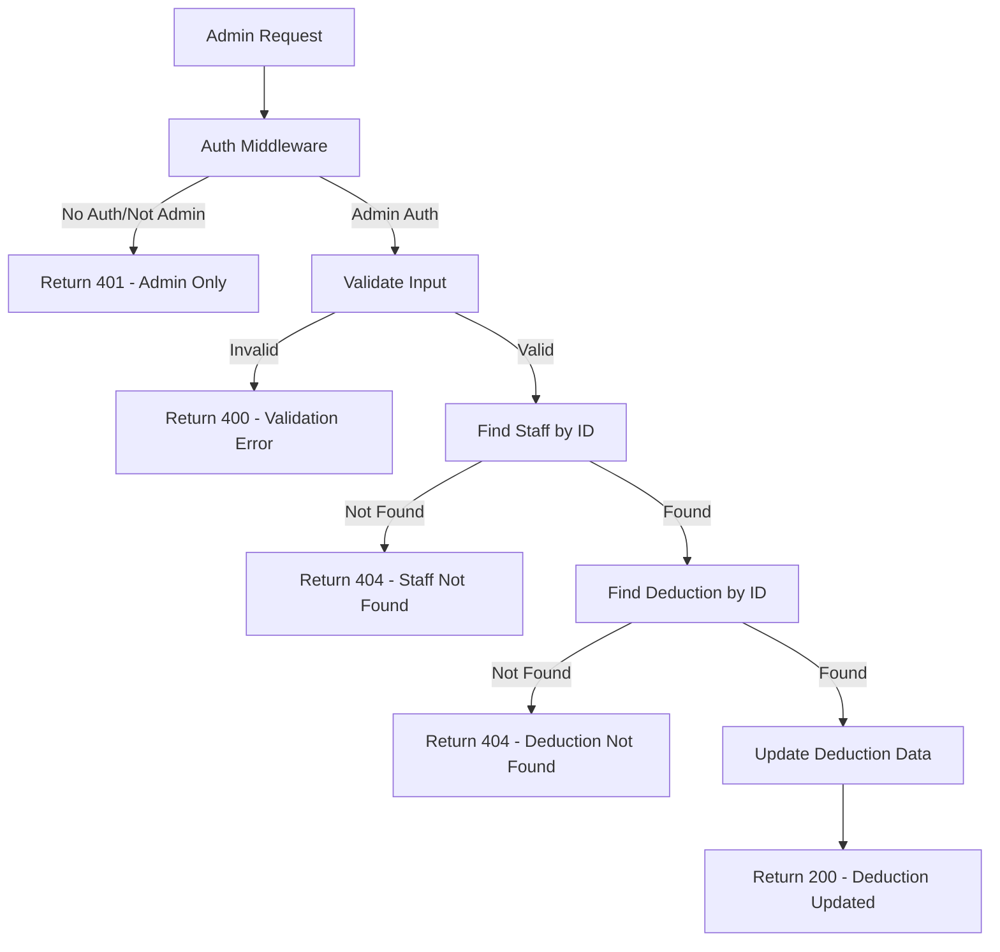
```mermaid
flowchart TD
    A[Admin Request] --> B[Auth Middleware]
    B -->|No Auth/Not Admin| C[Return 401 - Admin Only]
    B -->|Admin Auth| D[Validate Input]
    D -->|Invalid| E[Return 400 - Validation Error]
    D -->|Valid| F[Find Staff by ID]
    F -->|Not Found| G[Return 404 - Staff Not Found]
    F -->|Found| H[Find Deduction by ID]
    H -->|Not Found| I[Return 404 - Deduction Not Found]
    H -->|Found| J[Update Deduction Data]
    J --> K[Return 200 - Deduction Updated]
```

### 11. DELETE /api/v1/staff/admin/:id/deductions/:deductionId - Remove Deduction

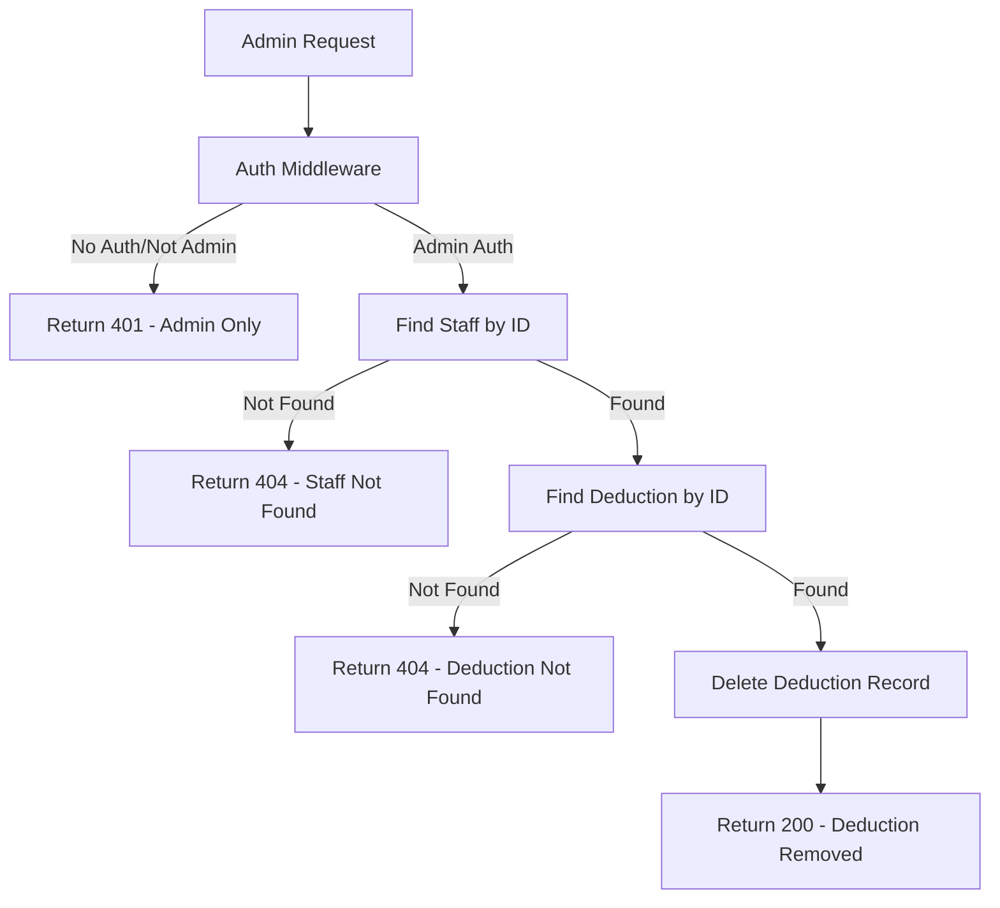
```mermaid
flowchart TD
    A[Admin Request] --> B[Auth Middleware]
    B -->|No Auth/Not Admin| C[Return 401 - Admin Only]
    B -->|Admin Auth| D[Find Staff by ID]
    D -->|Not Found| E[Return 404 - Staff Not Found]
    D -->|Found| F[Find Deduction by ID]
    F -->|Not Found| G[Return 404 - Deduction Not Found]
    F -->|Found| H[Delete Deduction Record]
    H --> I[Return 200 - Deduction Removed]
```

## Staff Salary APIs (Admin Only)

### 12. GET /api/v1/staff/admin/:id/salary/:month - Get Monthly Salary

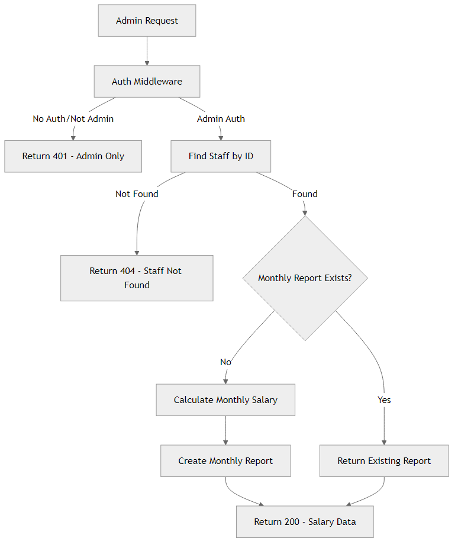

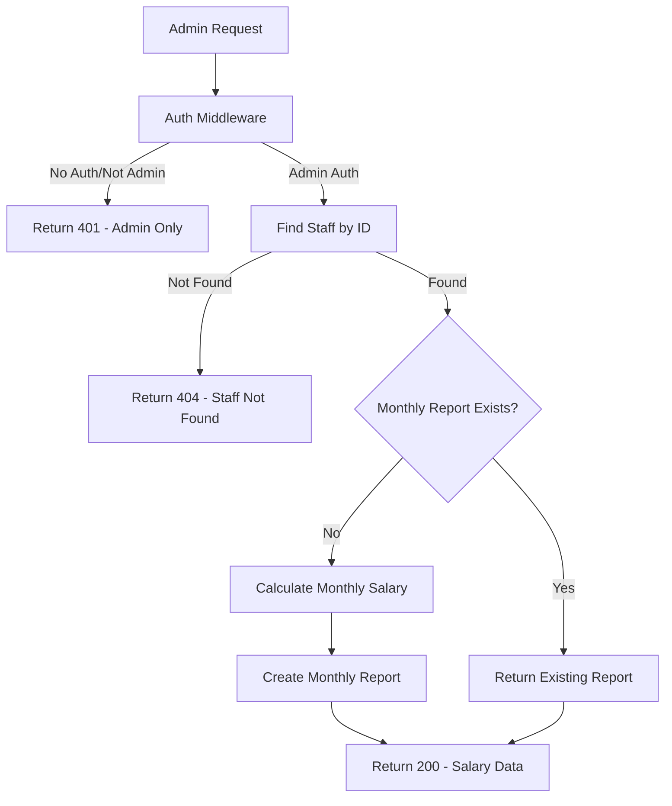
```mermaid
flowchart TD
    A[Admin Request] --> B[Auth Middleware]
    B -->|No Auth/Not Admin| C[Return 401 - Admin Only]
    B -->|Admin Auth| D[Find Staff by ID]
    D -->|Not Found| E[Return 404 - Staff Not Found]
    D -->|Found| F{Monthly Report Exists?}
    F -->|No| G[Calculate Monthly Salary]
    G --> H[Create Monthly Report]
    H --> I[Return 200 - Salary Data]
    F -->|Yes| J[Return Existing Report]
    J --> I
```

### 13. PATCH /api/v1/staff/admin/:id/salary/:month/pay - Mark Salary as Paid

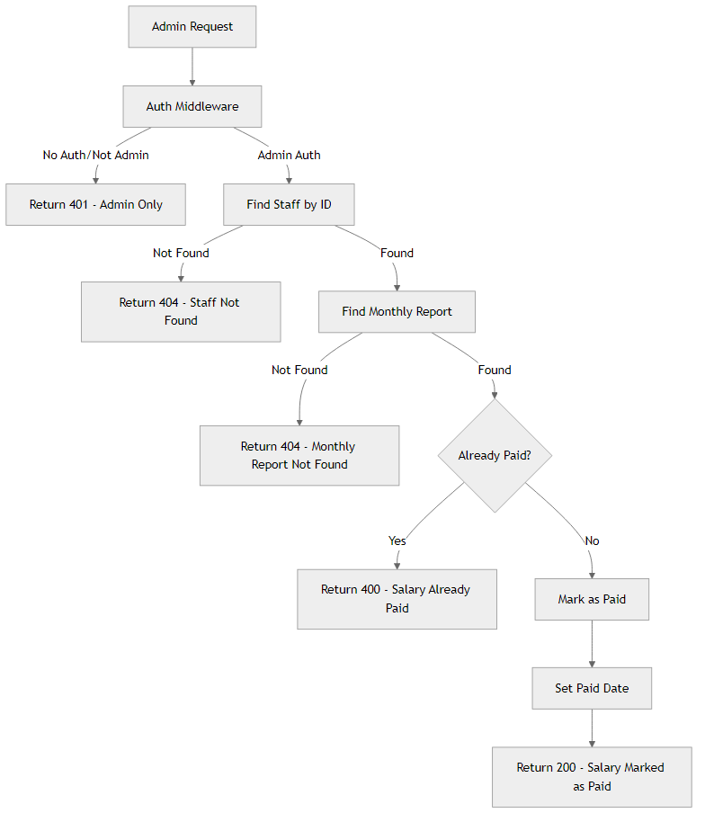

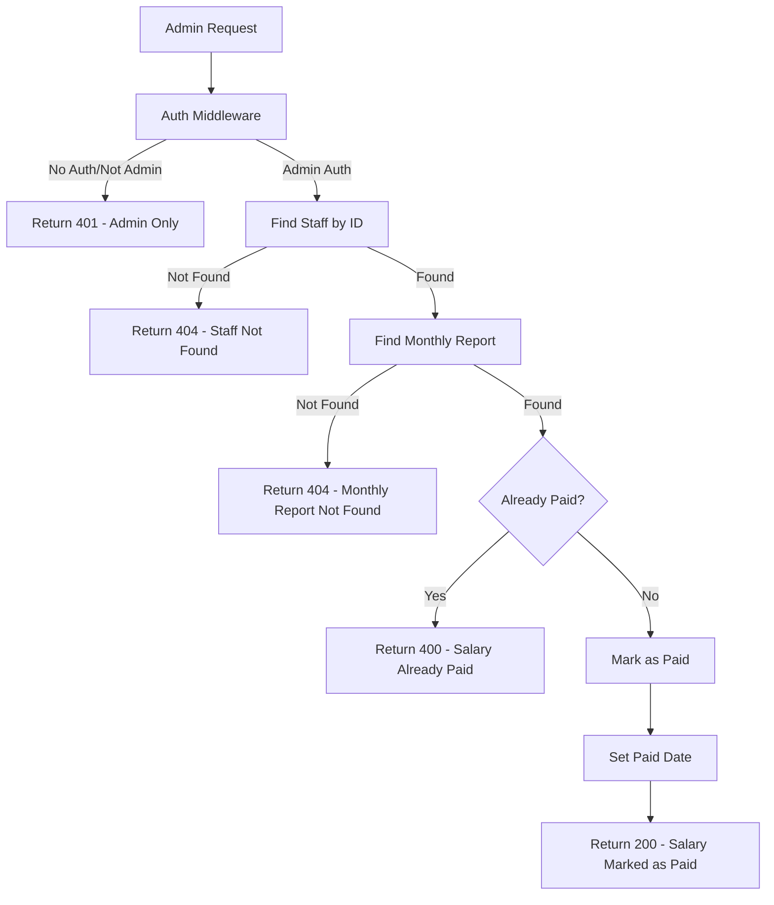
```mermaid
flowchart TD
    A[Admin Request] --> B[Auth Middleware]
    B -->|No Auth/Not Admin| C[Return 401 - Admin Only]
    B -->|Admin Auth| D[Find Staff by ID]
    D -->|Not Found| E[Return 404 - Staff Not Found]
    D -->|Found| F[Find Monthly Report]
    F -->|Not Found| G[Return 404 - Monthly Report Not Found]
    F -->|Found| H{Already Paid?}
    H -->|Yes| I[Return 400 - Salary Already Paid]
    H -->|No| J[Mark as Paid]
    J --> K[Set Paid Date]
    K --> L[Return 200 - Salary Marked as Paid]
```

### 14. PUT /api/v1/staff/admin/:id/salary/:month/adjust - Adjust Salary

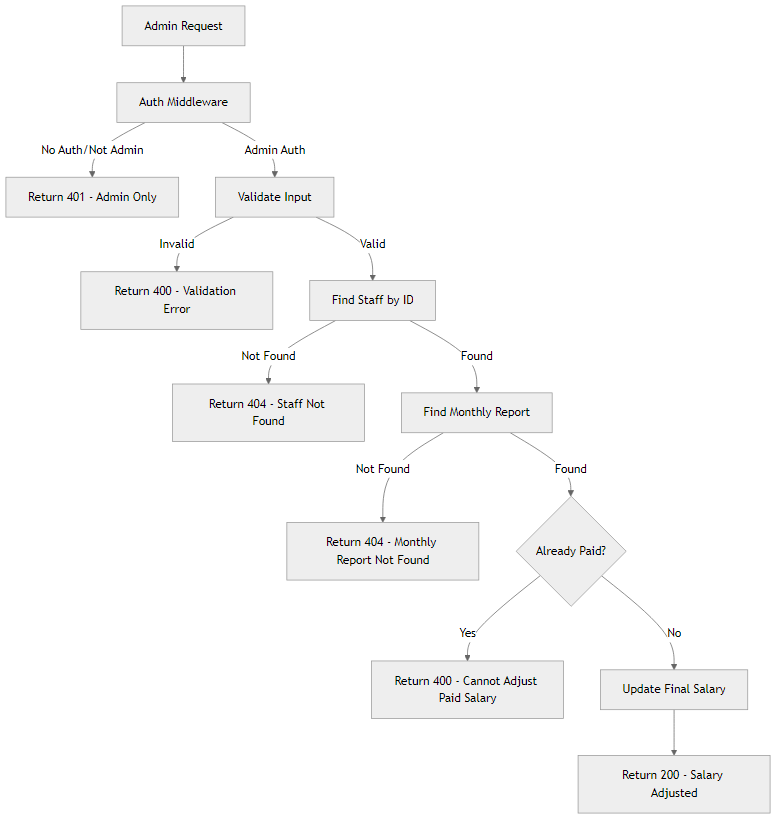

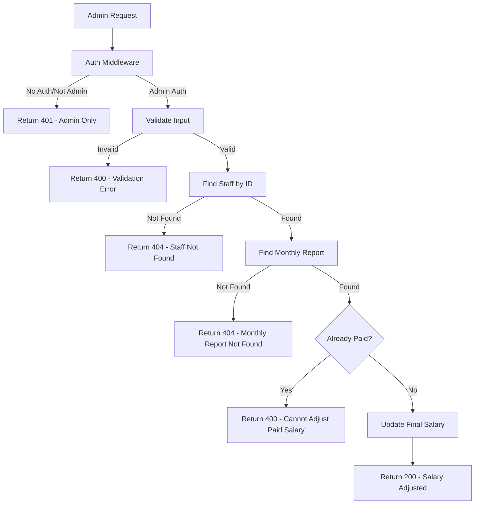
```mermaid
flowchart TD
    A[Admin Request] --> B[Auth Middleware]
    B -->|No Auth/Not Admin| C[Return 401 - Admin Only]
    B -->|Admin Auth| D[Validate Input]
    D -->|Invalid| E[Return 400 - Validation Error]
    D -->|Valid| F[Find Staff by ID]
    F -->|Not Found| G[Return 404 - Staff Not Found]
    F -->|Found| H[Find Monthly Report]
    H -->|Not Found| I[Return 404 - Monthly Report Not Found]
    H -->|Found| J{Already Paid?}
    J -->|Yes| K[Return 400 - Cannot Adjust Paid Salary]
    J -->|No| L[Update Final Salary]
    L --> M[Return 200 - Salary Adjusted]
```

## Error Handling Patterns

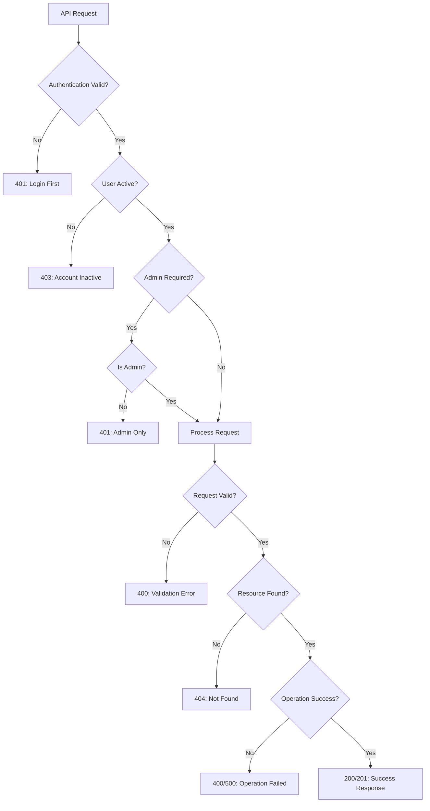
```mermaid
flowchart TD
    A[API Request] --> B{Authentication Valid?}
    B -->|No| C[401: Login First]
    B -->|Yes| D{User Active?}
    D -->|No| E[403: Account Inactive]
    D -->|Yes| F{Admin Required?}
    F -->|Yes| G{Is Admin?}
    G -->|No| H[401: Admin Only]
    G -->|Yes| I[Process Request]
    F -->|No| I
    I --> J{Request Valid?}
    J -->|No| K[400: Validation Error]
    J -->|Yes| L{Resource Found?}
    L -->|No| M[404: Not Found]
    L -->|Yes| N{Operation Success?}
    N -->|No| O[400/500: Operation Failed]
    N -->|Yes| P[200/201: Success Response]
```

## Staff Status Flow

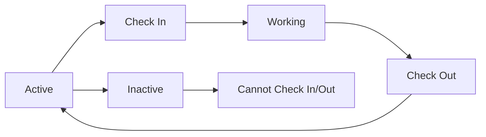
```mermaid
flowchart LR
    A[Active] --> B[Check In]
    B --> C[Working]
    C --> D[Check Out]
    D --> A
    A --> E[Inactive]
    E --> F[Cannot Check In/Out]
```
