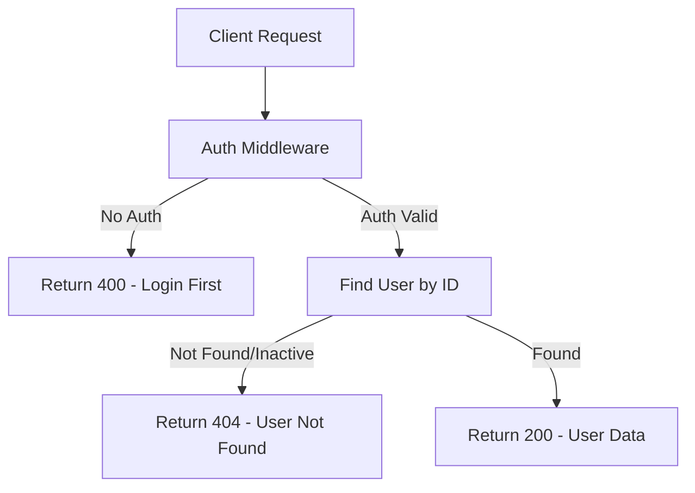
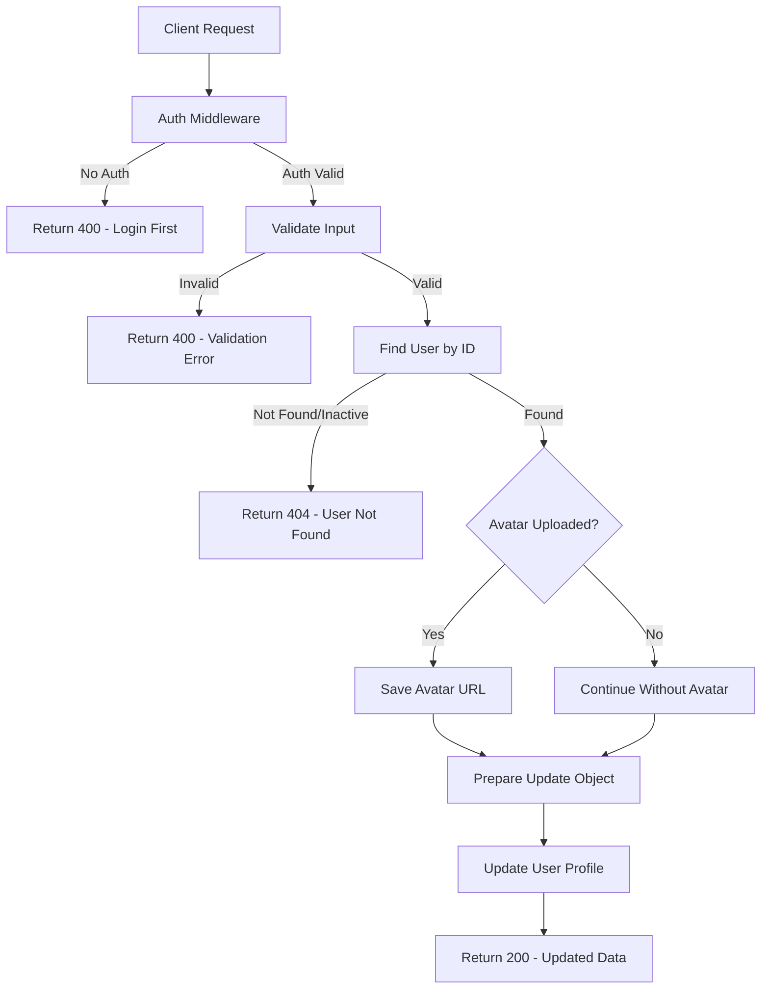
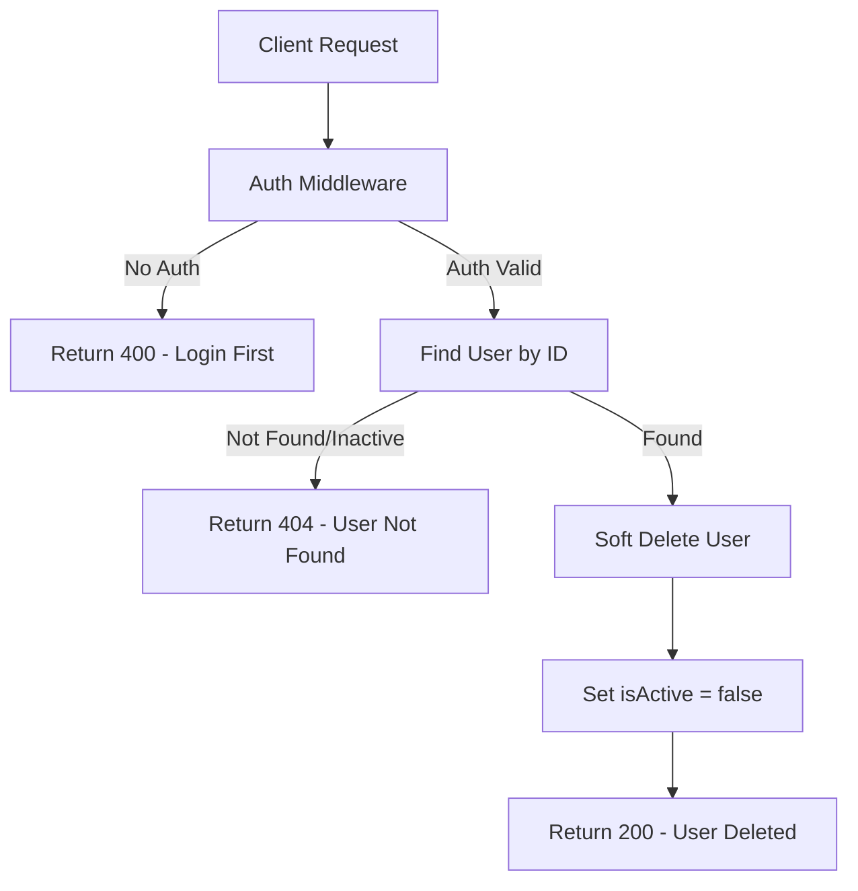
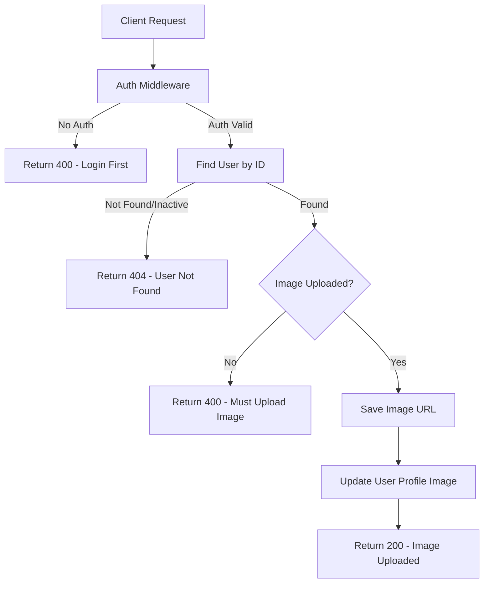

# User APIs Flowcharts

## 1. GET /api/v1/users/profile

```mermaid
flowchart TD
    A[Client Request] --> B[Auth Middleware]
    B -->|No Auth| C[Return 400 - Login First]
    B -->|Auth Valid| D[Find User by ID]
    D -->|Not Found/Inactive| E[Return 404 - User Not Found]
    D -->|Found| F[Return 200 - User Data]
```

## 2. PUT /api/v1/users/profile

```mermaid
flowchart TD
    A[Client Request] --> B[Auth Middleware]
    B -->|No Auth| C[Return 400 - Login First]
    B -->|Auth Valid| D[Validate Input]
    D -->|Invalid| E[Return 400 - Validation Error]
    D -->|Valid| F[Find User by ID]
    F -->|Not Found/Inactive| G[Return 404 - User Not Found]
    F -->|Found| H{Avatar Uploaded?}
    H -->|Yes| I[Save Avatar URL]
    H -->|No| J[Continue Without Avatar]
    I --> K[Prepare Update Object]
    J --> K
    K --> L[Update User Profile]
    L --> M[Return 200 - Updated Data]
```

## 3. DELETE /api/v1/users/profile

```mermaid
flowchart TD
    A[Client Request] --> B[Auth Middleware]
    B -->|No Auth| C[Return 400 - Login First]
    B -->|Auth Valid| D[Find User by ID]
    D -->|Not Found/Inactive| E[Return 404 - User Not Found]
    D -->|Found| F[Soft Delete User]
    F --> G[Set isActive = false]
    G --> H[Return 200 - User Deleted]
```

## 4. POST /api/v1/users/upload-profile-image

```mermaid
flowchart TD
    A[Client Request] --> B[Auth Middleware]
    B -->|No Auth| C[Return 400 - Login First]
    B -->|Auth Valid| D[Find User by ID]
    D -->|Not Found/Inactive| E[Return 404 - User Not Found]
    D -->|Found| F{Image Uploaded?}
    F -->|No| G[Return 400 - Must Upload Image]
    F -->|Yes| H[Save Image URL]
    H --> I[Update User Profile Image]
    I --> J[Return 200 - Image Uploaded]
```
